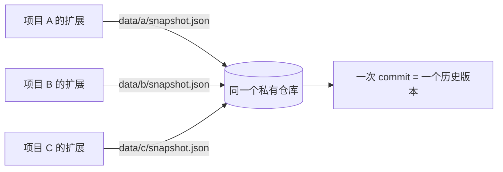
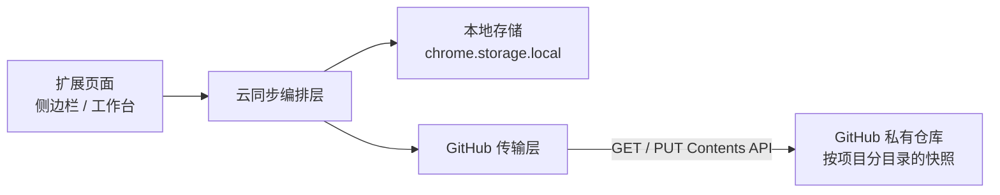

# 把浏览器扩展的数据同步到 GitHub：用代码仓库当云端存储

浏览器扩展的数据默认只躺在 `chrome.storage.local` 里，清理一次缓存、换一台电脑，就全没了。想做云备份，通常意味着自己运维一个服务，或者去注册某个第三方 BaaS。这篇拆一个更省事的做法：把 GitHub 私有仓库当云端存储，一份 JSON 快照对应仓库里的一个文件，每次上传就是一个 commit。而这个仓库不只是"某个项目的备份盘"——它是一个统一的数据存放位置，多个项目各写各的文件即可。

## 1. 为什么选 GitHub

先说结论：GitHub 不是"最适合"存业务数据的地方，但它是**综合成本最低**的地方。下面几个理由都是白拿的。

**它是一个统一的数据存放位置。** 仓库不是"某个项目的附属品"，而是一个可以独立存在的存储单元。多个项目、多个浏览器扩展都可以往同一个仓库里写，各写各的文件 —— 你不需要为每个项目单独搭一套服务，也不用在几个后台之间做取舍。入口只有一个，东西都在那儿，备份、迁移、清理都变成对着同一个地方操作。

这一条是后面所有设计的前提。把它理解成"给一个插件加个备份功能"就窄了：正确的形态是**先准备好一个公共的数据存放位置，再让各个项目各自接入**。所以下面讲的文件路径、令牌、目录布局，都建立在"会有多个项目"这个前提上。

**版本历史是免费的。** 每次上传都是一次 commit，云端天然保留所有历史版本。误删、误覆盖、传错了内容，都可以去仓库的提交记录里找回。这一点比大多数 KV / 对象存储方案都强 —— 它们覆盖完就是覆盖完了。

**鉴权是现成的。** Fine-grained token 支持把权限精确到"只对某一个仓库的 Contents 读写"，不需要自己写用户系统。

**不需要运维。** 没有部署、没有域名、没有证书、没有数据库，也不需要为谁的数据承担合规责任。

::: warning 先实测可达性

选型前一定要先测目标域名在你的网络下能不能通，别凭"应该能用"就开工。我实测的结果是：`workers.dev` 解析到了一个完全不属于 Cloudflare 网段的地址、连接直接超时；`gist.github.com` 同样是被污染的地址；而 `api.github.com` 正常返回。

判断方法就两条：

```bash
dig +short <域名>            # 看返回的 IP 是否属于该服务真实网段
curl -o /dev/null -w '%{http_code} %{time_total}s\n' https://<域名>/
```

返回任意 HTTP 状态码（403、404 都算）说明通了；超时或 `000` 就是不通。

:::

还有一个比选哪个后端都重要的原则：**公开分发的扩展绝不能内嵌共享密钥**。扩展包任何人下载后都能解包，密钥等于公开。要做多人共用的在线服务，就必然要自己承担账号系统、配额、隐私合规和运营责任；所以更务实的路线是 **BYO（Bring Your Own）** —— 扩展不带任何服务端密钥，每个用户填自己的仓库和令牌，开发者什么都不用运营。下面的方案就是这个形态。

## 2. GitHub 侧配置

### 2.1 建一个私有仓库

新建一个仓库，勾选 Private。

::: tip 仓库是给所有项目共用的

不要为每个项目单独建仓库，建一个就够。各项目用不同目录区分（见第 4 节）。仓库建多了，管理成本上来了，"统一存放位置"的意义也就没了。

当然，如果你的项目分属不同的信任级别 —— 比如自研扩展和来路不明的第三方扩展 —— 那就该分开建，因为令牌是仓库级的（见 4.4）。

:::

### 2.2 建最小权限令牌

在 GitHub 设置里新建一个 **Fine-grained personal access token**，三项都要配对：

| 配置项 | 取值 | 为什么 |
|---|---|---|
| Repository access | Only select repositories | 令牌只认这一个仓库 |
| Permissions → Repository permissions | **Contents: Read and write** | 读写数据文件仅需 Contents |
| Token expiration | 按需 | 建议设置有效期，到期前重新生成 |

Permissions 那一栏很容易手滑勾多。`Administration`、`Workflows` 之类的权限对同步完全没用，多勾一个就多一份风险面。

### 2.3 验证令牌可用

在填进插件之前，先用命令行确认一遍。这一步能把绝大多数配置错误挡在插件之外：

```bash
curl -s -o /dev/null -w '%{http_code}\n' \
  -H "Authorization: Bearer <token>" \
  https://api.github.com/repos/<owner>/<repo>
```

`200` 通过；`401` 是令牌无效或过期；`404` 通常是令牌没授权到这个仓库（GitHub 对无权限的私有仓库故意返回 404 而不是 403，避免泄露仓库是否存在）。

## 3. 插件侧配置项

设置页需要暴露的字段不多，但每一个都有明确用途：

| 配置项 | 说明 |
|---|---|
| 仓库 | `owner/repo`，也允许直接粘贴仓库网页地址或 SSH 地址，内部统一归一化成 `owner/repo` |
| 文件路径 | 仓库内的存放位置，目录不存在会自动创建。**多项目共用一个仓库时，它就是项目之间的分区键** |
| 访问令牌 | 密码框存储，默认掩码显示，可点眼睛图标查看 |
| 自动上传 | 开关。关闭时完全不发请求 |
| 上传间隔 | 自动上传的静默时间，1–120 分钟，默认 5 |

每个项目填自己的那一组配置：仓库地址和令牌可以完全相同，只有文件路径不同。这样"多个项目往同一个仓库存"这件事，在配置层面就完成了。

配套三个动作按钮：

- **测试连接**：请求一次仓库信息 + 目标文件，把"令牌无效"、"仓库不存在"、"云端还没有备份文件"分开报给你。写入权限只有真正上传时才能确认，所以这一步只能验证到读。
- **立即上传**：用本地数据覆盖云端文件。
- **从云端恢复**：把云端快照合并进本地。

这些配置本身也只是普通数据，跟着放进扩展存储就行：

```json
{
  "repo": "your-name/cws-data",
  "path": "data/prompt-manager/snapshot.json",
  "token": "github_pat_xxx",
  "autoPush": true,
  "autoPushDelayMinutes": 5,
  "lastPushedAt": 1750000000000
}
```

## 4. 多项目共用仓库

这一节是整个方案里最值得展开的部分。前提很简单：**仓库是一个独立于项目的存储位置，项目的边界由文件路径来划**。

### 4.1 数据流长什么样



各项目互不知情，它们只是往同一个位置写自己的文件。你甚至可以先接一个项目跑通，再随时往上加第二个。

### 4.2 目录布局

按项目分目录，不要平铺：

```text
data/
├── prompt-manager/snapshot.json
├── other-extension/snapshot.json
└── third-extension/snapshot.json
```

平铺成 `data/a.json`、`data/b.json` 也能跑，但项目一多就分不清哪个文件是谁的，排查问题全靠猜。分目录还顺带解决了一个现实问题：不同项目的数据量差别可能很大，分开看某个项目的历史时不会被别人的提交刷屏。

### 4.3 为什么必须分文件

如果反过来做成"所有项目的数据塞进同一个 JSON"，就会引入一个共享写点：每个项目上传时都得先读出别人的数据、把自己的段落合并进去再整体写回。两个项目同时上传就会 409 冲突，而且任何一方漏了合并就会覆盖掉另一方。

拆成不同文件之后，每个文件有自己独立的 sha 和独立的提交记录，项目之间在 GitHub 这一层完全隔离，只有仓库和令牌是共享的。各项目连上传时机都不用对齐。

### 4.4 共享与隔离的边界

清楚这条边界，才知道风险在哪：

- **共享的**：仓库本身、访问令牌、API 调用配额、仓库的提交历史。
- **隔离的**：数据文件、每次上传的提交、冲突与重试逻辑。

**最需要警惕的是令牌。** 令牌是仓库级的，意味着任何一个项目一旦出了 XSS 或供应链投毒，攻击者就能读写**仓库里所有项目的数据文件**。所以划分仓库的标准不是"项目数量"，而是"信任级别"：自研的几个扩展放一个仓库没问题；装了不可信来源的扩展，就该给它单独一个仓库。

### 4.5 撞名与配额

**默认路径必须带项目标识。** 撞名的后果是静默覆盖：两个项目按同一个默认值上传，各自都显示"上传成功"，但数据在互相覆盖，而且因为是覆盖式上传，丢的那份只能去提交历史里捞。做法是让默认值强制包含项目 id，并写一条测试断言默认值里含项目标识。

**配额不是问题。** 认证后的 GitHub API 是每用户 5000 次/小时。按 5 分钟一次自动上传算，一个项目 12 次/小时，十个项目也才 120 次/小时，离上限差两个数量级。

### 4.6 怎么让第二个项目接进来

前提是同步代码本身与业务数据解耦。合理的切法是两层：

- **传输层**不认识业务数据，只负责配置、base64 编解码、上传下载、409 重试、错误映射。换后端（比如改成自建服务）也只改这一层。
- **编排层**接受一个"提供者"接口，由每个项目实现两个方法：怎么把自己的数据采集成一份快照，怎么把一份快照合并回自己的存储。

条目结构不一样，"时间戳新者胜"的细节也就各不相同，这些都该由各自的提供者负责，编排层只管调度、防抖、传输。

这样第二个项目要做的，就是实现那两个方法 + 填一份配置，不用碰任何同步基础设施。

## 5. 技术方案

### 5.1 整体架构

传输层与业务无关，编排层与 HTTP 无关：



### 5.2 快照格式

云端存的就是本地备份功能的产物，一个完整 JSON 对象：

```json
{
  "app": "my-extension",
  "version": 1,
  "exportedAt": "2026-09-24T08:00:00.000Z",
  "prompts": [{ "id": "...", "title": "...", "content": "...", "createdAt": 1, "updatedAt": 2 }],
  "templates": [],
  "folders": []
}
```

关键设计是**沿用已有的备份格式**，而不是为同步另造一套。这样导入导出和云同步共用同一套解析与合并逻辑，也保证了老版本导出的文件能被新版本读懂。

界面偏好（折叠状态、换行开关之类）不进快照 —— 它们是设备相关的，云端同步它们只会制造噪音。

### 5.3 读写都用 Contents API

不用 Git Trees API，也不用单独的上传接口，Contents API 一次读写一个文件就够了。

读：GET 拿到 `sha` 和 base64 的 `content`。写：PUT 带上当前的 `sha` 作为"我基于哪个版本改的"凭据，GitHub 校验不匹配就返回 `409`。

所以上传的完整流程是：先 GET 拿 sha（404 说明文件不存在，那就是新建），再 PUT 提交新内容。

### 5.4 CORS 与权限

从扩展页面直接 `fetch` 跨域的 GitHub API，会先触发 CORS 预检。实测 GitHub 的预检响应是完全放开的：

```text
access-control-allow-origin: *
access-control-allow-headers: Authorization, Content-Type, ...
access-control-allow-methods: GET, POST, PATCH, PUT, DELETE
```

这意味着**不需要在 manifest 里加 `host_permissions`**。这一点值得专门测一下而不是想当然，因为一旦预检不过，就得多申请一个"读取和更改 api.github.com 上数据"的安装提示，代价大很多。

```bash
curl -s -X OPTIONS -o /dev/null -D - \
  -H 'Origin: chrome-extension://example' \
  -H 'Access-Control-Request-Method: PUT' \
  -H 'Access-Control-Request-Headers: authorization,content-type' \
  https://api.github.com/repos/owner/repo/contents/data/sync.json | grep -i '^access-control'
```

### 5.5 上传覆盖，不是合并

上传时**不做**任何"先拉下来再合并"的预处理，就是用本地快照直接覆盖云端文件。

有人会担心这会丢云端独有的数据，但在这里覆盖是刻意的选择：上传前先合并的话，两边数据会变成只增不减的并集，**你删掉的条目永远传不上去**，云端会变成一个越用越脏的垃圾堆。而 GitHub 的 commit 历史天然兜底 —— 覆盖掉的上一版内容完整躺在提交记录里，随时能取回。

一句话：**用不可逆的操作换一个干净的存储语义，历史负责兜底。**

### 5.6 恢复走合并，删除会复活

恢复方向相反，用的是"按 id 对齐、时间戳新者胜"的合并：本地没有的条目新增，两边都有且云端更新则覆盖本地，本地独有且云端没有的不动。

代价是明确的：**本地已删除、云端还存在的条目会被恢复回来。** 因为合并逻辑只处理"两边都有"和"只有云端有"，它无从知道你是"想删"还是"云端还没同步到这次删除"。

真要解决得引入墓碑：删除时不直接移除，而是写一条 `{ id, deletedAt }` 到快照里，合并时按 `deletedAt` 判断谁更晚，过期的墓碑定期清理。这会改动数据格式和校验逻辑，兼容风险不小，所以我没做，而是在设置页里把这条限制明确写出来。

### 5.7 自动上传是防抖，不是定时轮询

自动上传的语义是"编辑停止 N 分钟后传一次"，实现是保存成功后重置一个防抖定时器。连续编辑 20 分钟只会产生一个版本，而不是几十个。

另外补一个启动时的检查：打开侧边栏时比较本地最新的修改时间与 `lastPushedAt`，发现有没传上去的改动就补一次。因为定时器是页面内的，关掉面板就没了，下次打开必须能自愈。

::: danger 自动上传不是后台任务

这个定时器活在扩展页面的 JS 上下文里。关掉侧边栏，页面就没了，不会有任何东西在后台等着上传。

要真正后台化，标准做法是用 background service worker 加 `chrome.alarms`，但那样 service worker 跨域请求就需要在 manifest 里声明 `host_permissions`，安装时会多一个权限提示。MV3 的 `alarms` 最小周期还是分钟级，跟现有配置的粒度正好吻合 —— 值不值得为此加一个权限提示，取决于你关面板的习惯。

:::

## 6. 代码实现要点

实现比想象中薄，几处容易踩的地方值得记下来。

**base64 必须先转字节。** `btoa` 只接受 Latin-1 字符，中文直接抛异常。GitHub 返回的 base64 还带换行，解码前也要先清掉空白：

```js
export function encodeBase64Utf8(text) {
  const bytes = new TextEncoder().encode(text);
  let binary = '';
  for (const byte of bytes) binary += String.fromCharCode(byte);
  return btoa(binary);
}

export function decodeBase64Utf8(base64) {
  const binary = atob(base64.replace(/\s/g, ''));
  const bytes = Uint8Array.from(binary, (char) => char.charCodeAt(0));
  return new TextDecoder().decode(bytes);
}
```

**409 冲突重试一次。** 取完 sha 到提交之间，云端可能被别人改了。重新取一次 sha 再提交，只重试一次，避免无限循环：

```js
if (response.status === 409 && attempt === 0) {
  existing = await fetchRemoteFile(config, repo, path);
  continue;
}
```

**配置值必须归一化。** 间隔这个数字可能来自旧版本数据、手改过的存储，或用户输入到一半的半截数字。读取和保存两端都过一遍归一化，绝不能让 `NaN` 变成 `setTimeout` 的延时 —— 那会变成立即执行：

```js
export function normalizeAutoPushDelay(value) {
  const fallback = 5;
  if (typeof value !== 'number' || !Number.isFinite(value)) return fallback;
  return Math.min(120, Math.max(1, Math.round(value)));
}
```

**防抖要考虑异步竞态。** 间隔改成从配置里读之后，调度函数就变成异步的了。如果不加保护，连续两次调度会各起一个定时器，防抖直接失效。用一个递增序号做守卫，只有最后一次能继续：

```js
scheduleSeq += 1;
const seq = scheduleSeq;
if (autoPushTimer) clearTimeout(autoPushTimer);
const config = await loadSyncConfig();
if (seq !== scheduleSeq) return;   // 期间又来了新的调度，让给它
```

**错误要翻译成人话。** 直接把 HTTP 状态码抛给用户没有意义，映射成可执行的提示：

```js
case 401: return '访问令牌无效或已过期，请重新生成 Token';
case 403: return '令牌权限不足或已触发 GitHub 限流：请确认 Token 对该仓库有 Contents 读写权限';
case 404: return '找不到仓库或文件：请确认仓库名正确，且 Token 已授权该仓库';
```

网络类异常在浏览器里只有英文原文（`Failed to fetch`、超时的 `TimeoutError`），也要单独兜一层成"请检查网络或代理设置"。

## 7. 容易踩的坑

- [x] **拿 Gist 当存储**。Gist 的域名在部分网络下不可达，而且 fine-grained token 对 Gist 的支持也不如仓库顺手。直接用私有仓库。
- [x] **每个项目单独建一个仓库**。仓库一多，"统一存放位置"就没了，管理成本还翻倍。按信任级别分就行。
- [x] **默认文件路径没带项目标识**。两个项目撞名会静默覆盖，各自都显示成功。
- [x] **把不可信扩展和自研扩展放同一个仓库**。令牌是仓库级的，XSS 的影响面按仓库算。
- [x] **令牌勾太多权限**。同步只需要一个仓库的 Contents 读写。
- [x] **中文 base64 编码**。`btoa` 会直接抛错，这个 bug 在纯英文数据下测不出来。
- [x] **忘了 409 冲突**。不做重试就会偶发失败，且必现于多设备同时上传。
- [x] **把配置值直接当延时用**。`NaN` 变成 0 延时，防抖形同虚设。
- [x] **假设删除会同步**。覆盖式上传 + 合并式恢复的组合下，删除不会传播，必须在 UI 上说清楚。
- [x] **把密钥写进代码**。用户令牌存在扩展本地存储里，随时可去 GitHub 撤销；扩展包里一个服务端密钥都不能有。

## 8. 小结

这个方案真正的价值不在技术难度，而在于它把"要不要自己搭一套服务"这个问题整个消掉了：仓库是现成的、鉴权是现成的、版本历史是白拿的，更关键的是它**一次就把多个项目的数据存放位置准备好了** —— 后面接进来的项目只需要一个不同的文件路径，不用再谈一次部署、域名、证书和运维。

代价也很明确：要接受"上传覆盖 + 恢复合并"这个语义组合，接受删除不传播这个限制，以及清楚令牌是仓库级的、影响面按仓库算。

如果要把这套位置开放给不熟悉你项目的其他人，那就完全是另一个问题了 —— 那时候真正要解决的不是存储选型，而是密钥怎么签发、谁承担数据责任。扩展分发的安全边界决定了：**能被解包的客户端，永远不能持有服务端密钥。**
