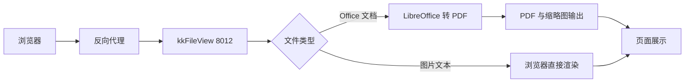

# 用 kkFileView 搭一个文件在线预览服务

内网里堆着各种文档，docx、xlsx、pptx、pdf 混在一起。每次想快速看一眼内容，都要先下载、再装 Office 或 WPS，看完再删掉，纯属浪费时间。更别说分享给别人时，对方还得先问一句"你装 Office 了吗"。

kkFileView 解决的就是这个场景：一个容器跑起来，浏览器里直接预览文件。它内部靠 LibreOffice 把 Office 文档转成 PDF 或图片，前端再渲染出来，业务系统只要拼一个 URL 就能接入。

## 1. 选它的两个理由

### 1.1 格式覆盖广

这一点是最省事的地方——主流格式基本都在支持列表里：

- Office 全家桶：doc、docx、xls、xlsx、ppt、pptx、csv，以及 wps、et、dps 等国产格式
- 文档类：pdf、ofd、rtf、epub
- 图片与设计文件：jpg、png、gif、tif、psd、svg
- 工程类文件：vsd/vsdx（Visio）、dwg/dxf（CAD）、xmind、bpmn、drawio
- 压缩包：zip、rar 可以直接列出目录，点进去逐个预览
- 代码文本：java、py、sql、md、json、yaml 等带语法高亮
- 音视频：mp4、mp3 直接播放

需要装一堆转换工具才能看的格式，这里一个容器全包了。

### 1.2 接入成本低

它是个独立服务，和业务系统完全解耦。业务侧只要拼一个 URL：

```text
http://<预览服务地址>/onlinePreview?url=<base64 编码后的文件地址>
```

跨语言、跨系统都能用。服务本身自带一个演示页，可以上传文件、也可以输入地址预览，上线前先用它验证格式兼容性很方便。

## 2. 容器化部署

### 2.1 启动命令

一条命令就能跑起来，不需要额外的依赖：

```bash
docker run -d --name kkfileview \
  --restart unless-stopped \
  -p 8012:8012 \
  -v /opt/kkfileview/file:/opt/kkFileView-4.1.0/file \
  -e TZ=Asia/Shanghai \
  keking/kkfileview:latest
```

起来之后访问 `http://<主机地址>:8012` 就能看到演示页：


页面上有三块能直接用的东西：接入说明（含前端调用示例代码）、输入下载地址预览、以及上传本地文件预览。

### 2.2 路径别挂错

容器里的文档根目录是 `/opt/kkFileView-4.1.0/file`，注意中间那个大写 `K`。挂载路径写错的话容器照样正常启动，只是你放进去的文件预览时全都找不到，排查起来挺费时间。启动日志里会打印一行确认：

```text
Add resource locations: /opt/kkFileView-4.1.0/file/
```

看到这行说明目录挂对了。

## 3. 预览接口怎么调

### 3.1 两种预览源

预览源有两种传法，区别在于**谁来读文件**：

- **http 地址**：服务端自己去下载这个地址的文件，适合文件在别的服务上（对象存储、静态站）
- **本地文件**：服务端直接读本地磁盘，需要写成 `file://` 形式的绝对路径

整个链路的处理顺序大致是这样：



Office 类文件第一次预览会慢几秒（要等 LibreOffice 转换），转换结果会缓存，之后再打开就是秒开。

### 3.2 编码规则

`url` 参数不是明文，而是 **base64 编码后的完整地址**，并且作为 URL 参数还要再做一次 URL 编码：

```python
import base64, urllib.parse

path = "file:///opt/kkFileView-4.1.0/file/demo/report.pptx"
b64 = base64.b64encode(path.encode()).decode()
print(urllib.parse.quote(b64, safe=""))
```

拼出来的地址形如：

```text
http://<预览服务地址>/onlinePreview?url=ZmlsZTovLy9vcHQva2tGaWxlVmlldy00LjEuMC9maWxlL2RlbW8vcmVwb3J0LnBweHR4
```

这里有个容易踩的点：**本地文件必须写成 `file:///` 开头的完整 URL**，直接编码 `/opt/...` 这样的裸路径会被服务的目录校验拦掉，报一个语焉不详的解析错误。

## 4. 反代上线的三个坑

本地跑通之后，我把它挂到了内网统一入口的反向代理后面（域名 + HTTPS），结果连着踩了三个坑，每个的报错信息都和真实原因不对应，值得单独记一下。

### 4.1 链接跳回 http

服务在反代后面时，页面里生成的预览链接、图片地址全是 `http://`，浏览器直接报了混合内容警告。

原因是没有配置 `base.url`。这个配置项决定服务生成链接时用哪个地址——不配的话它按当前请求推断，而反代到后端这段走的是纯 http，推断出来的自然也是 http。

```properties
base.url = https://office.example.com
```

配上之后，页面内所有链接就都跟着走域名和 https 了。

### 4.2 提示不支持预览

第二个坑最迷惑人。点击预览，页面弹出：

```text
该(pptx)文件，系统暂不支持在线预览，具体原因如下：
office.example.com
```

看着像是 pptx 格式不支持，但 pptx 明明在支持列表里，而且"原因"那栏显示的居然是自己的域名。

翻了下源码才明白：列表页的"预览"按钮，传的预览源是 `base.url + 文件名` 拼出来的 **https 地址**，服务端需要自己去下载它。而预览服务跑在容器里，容器**解析不了这个内网域名**，下载时抛了 `UnknownHostException`——这个异常 `getMessage()` 返回的恰好就只有主机名。异常信息被直接塞进"不支持预览"的页面模板里，于是格式支持的锅就这么背上了。

::: warning 排查

看到"暂不支持在线预览"，先别怀疑格式，直接看容器日志里有没有下载失败或域名解析异常。支持列表里的格式报这个错，八成是**服务端拿不到文件**。

:::

修复要两步：

```bash
docker run -d --name kkfileview \
  --add-host office.example.com:198.51.100.30 \
  ...
```

一是把域名解析补进容器（`--add-host`，指向反代入口）；二是证书——内网域名用的是自签证书，Java 默认不信任，需要把证书导入容器 JDK 的 truststore：

```bash
# 从反代取出证书
openssl s_client -connect <反代地址>:443 -servername office.example.com </dev/null 2>/dev/null \
  | awk '/BEGIN CERTIFICATE/,/END CERTIFICATE/' > /tmp/office.crt

# 导入并持久化（挂载出来，避免容器重建后丢失）
docker cp /tmp/office.crt kkfileview:/tmp/office.crt
docker exec kkfileview keytool -importcert -noprompt -trustcacerts \
  -alias office -file /tmp/office.crt \
  -keystore /usr/local/jdk1.8.0_251/jre/lib/security/cacerts -storepass changeit
docker cp kkfileview:/usr/local/jdk1.8.0_251/jre/lib/security/cacerts \
  /opt/kkfileview/cacerts/cacerts
```

之后启动时把 cacerts 挂回容器，证书问题就一劳永逸了：

```bash
-v /opt/kkfileview/cacerts/cacerts:/usr/local/jdk1.8.0_251/jre/lib/security/cacerts
```

### 4.3 file 链接被拦

配了可信域名之后又冒出来一个新问题：之前能用的 `file://` 方式预览，突然全部被拒，提示"预览源文件来自不受信任的站点"。

这个过滤器的判断逻辑是取**预览源地址的 host** 去比对白名单。而 `file://` 形式的地址根本没有 host（取出来是空字符串），白名单非空的时候空字符串当然不匹配，于是被拦。

取舍就变成了：

- 保留白名单 → 安全性更好，但只能用 http 地址方式预览
- 清空白名单 → `file://` 和 http 地址都能用，代价是不再做 host 校验（内网自用可以接受）

我最后选了后者，把配置项注释掉即可：

```properties
#trust.host = your.preview.host
```

::: tip 兼容性

这套服务的老版本（4.1.x）代码里**没有处理 `X-Forwarded-Proto` 这类转发头**，而 `base.url` 又只能填一个值。这意味着域名入口和 IP 入口不可能同时拿到"各自正确"的页内链接，只能二选一——我选了域名优先，IP 访问时页内图片仍然指向域名。

:::

## 5. 预览效果

配好之后从域名的列表页点击预览，效果是这样的：


左边是缩略图导航，右上角页码和底部的页码下拉框可以快速翻页；右边是当前页的高清渲染。默认走的是图片模式（`office.preview.type=image`），每页转成一张图，滚动浏览比端着 PDF 阅读器轻快，手机上也能看。

同样的页面里，Excel 走的是纯前端渲染，能保留表格合并和样式；压缩包会列出目录树，点文件直接预览；文本和代码文件带语法高亮。

## 6. 小结

服务本体部署没什么难度，真正的成本都在"挂到反代后面"这一段。三个坑的共同点是：**报错信息都在说别的事**——格式不支持其实是域名解析失败，不受信任的来源其实是空 host，链接跳 http 其实是少配了一个选项。遇到这类问题，先看服务端日志，再回头看配置，比盯着页面的提示文字猜要快得多。

几个可以直接抄的经验：

- `base.url` 一定要配，且填服务的对外访问地址
- 容器里挂载路径写 `/opt/kkFileView-4.1.0/file`（大写 K）
- 挂到反代后面时，准备好解析（`--add-host`）和证书（导入 truststore）两件事
- 预览源用 `file://` 方式时，地址要编码成完整 URL，不能是裸路径

对内部文档分享、知识库附件预览这类需求，它的投入产出比相当高。
