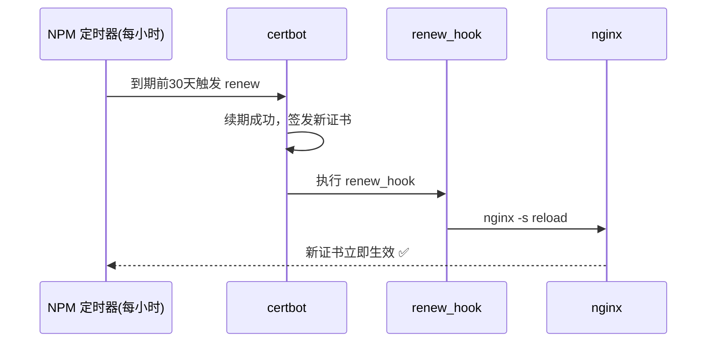

# NPM 续期证书不自动 reload？renew_hook 让它续期即生效

NPM（Nginx Proxy Manager）的 Let's Encrypt 证书有内置的自动续期机制，但很多人在续期后发现：面板里明明显示新证书，浏览器里却还是旧的那张。这篇文章记录了我对 NPM 2.12.6 的排查过程——问题根源、官方设计逻辑，以及我用 `renew_hook` 实现"续期即 reload"的完整方案和验证。

## 1. 问题：续期成功但没生效

某天我手动触发了一张证书的续期，流程返回 200，数据库里的 `expires_on` 也更新了。但用 `openssl s_client` 去测线上 443 端口，返回的证书还是旧的到期时间。

```bash
# 容器内：符号链接已指向新证书
$ ls -l /etc/letsencrypt/live/npm-17/fullchain.pem
fullchain.pem -> ../../archive/npm-17/fullchain4.pem

# 外网：还是旧证书的到期时间
$ echo | openssl s_client -connect 203.0.113.10:443 -servername share.example.com \
    2>/dev/null | openssl x509 -noout -dates
notBefore=Sep 10 16:18:35 2026 GMT
notAfter=Dec  9 16:18:34 2026 GMT
```

文件换新了，数据库更新了，nginx 却没加载新证书。**因为 nginx 只有在 reload 或 restart 时才会重新读取证书文件。**

## 2. 官方：renew 与 create 两路

我翻了 NPM 2.12.6 容器内的源码（`/app/internal/certificate.js`），发现证书的"新申请"和"续期"走的是完全不同的代码路径。

### 2.1 新申请：自带 reload

创建证书时，NPM 会生成临时的 ACME challenge 配置并 reload nginx 让验证路径生效，签发完成后再删配置、reload 恢复：

```text
1. 临时禁用占用域名的 proxy host
2. 生成 LE challenge nginx 配置
3. reload nginx          ← 让 /.well-known/acme-challenge 生效
4. sleep 5 秒
5. 执行 certbot certonly（HTTP-01 验证）
6. 删除 challenge 配置
7. reload nginx          ← 恢复正式配置
8. 恢复之前禁用的 host
9. 读证书到期时间，回写数据库
```

因为新申请必须让 nginx 立刻"认识"验证路径，所以 create 流程里 reload 是必要的、也是存在的。

### 2.2 续期：只更新数据不 reload

自动续期由内置定时器驱动：每小时检查一次，到期前 30 天触发，逐个执行续期。

```javascript
// 关键代码：renew 流程
const cmd = certbotCommand + ' renew --force-renewal ' +
    `--config '${letsencryptConfig}' ` +
    `--cert-name 'npm-${certificate.id}' ` +
    '--preferred-challenges "dns,http" ' +
    '--no-random-sleep-on-renew ' +
    '--disable-hook-validation ';

return utils.exec(cmd)
    .then(() => {
        // 读新证书到期时间，更新数据库 expires_on
        return getCertificateInfoFromFile(...);
    })
    .then(() => {
        // 写审计日志
        return auditLog.add(...);
    });
```

整个 renew 流程里**没有任何 nginx reload 调用**。NPM 的设计假设是：证书文件是符号链接（`live/npm-17` → `archive/npm-17/fullchainN.pem`），下次任何一次 reload 都会自动吃到新证书——它把 reload 推迟给了"将来某个自然时机"。

### 2.3 为什么这个坑不明显

两个因素掩盖了它：

- **续期提前量**：NPM 在到期前 30 天就续期，旧证书此时还有 30 天有效期，不 reload 只是"新证书没生效"，HTTPS 并不会立刻断。
- **触发频率低**：reload 经常被别的操作顺带触发（改 proxy、建证书都会 reload），多数时候用户根本注意不到。

只有当"旧证书已过期 + 期间没有任何一次 reload"同时发生，HTTPS 才会真正中断——这就是 NPM 社区里"证书明明续了却突然打不开"的常见剧本。

## 3. 官方建议：renew_hook

NPM 底层用 certbot，而 certbot 本身就提供了"续期成功后执行自定义命令"的标准机制——`renew_hook`（老版本叫 `deploy_hook`）。

官方文档没有单独为这个场景写教程，但 certbot 的 renewal 配置语法是公开标准：在 `/etc/letsencrypt/renewal/npm-<id>.conf` 的 `[renewalparams]` 区块里加一行，续期成功就会执行：

```ini
renew_hook = /usr/sbin/nginx -s reload
```

这比"定时任务定期 reload"优雅得多：

- **精确**：只在真正续期成功后执行，一年大约 20 次（5 张证书 × 每年 4 次）
- **零副作用**：不需要后台定时器每小时空转 reload
- **原生**：certbot 的标准字段，不 hack NPM 任何代码

## 4. 处理：证书挂 renew_hook

我在生产主机上给全部 5 张 LE 证书（npm-13/14/16/17/22）的 renewal 配置都加上了 hook。

```bash
# 进入容器，在每张证书的 [renewalparams] 里加一行
for f in /etc/letsencrypt/renewal/npm-*.conf; do
    sed -i '/^\[\[webroot_map\]\]/i renew_hook = /usr/sbin/nginx -s reload' "$f"
done
```

### 4.1 踩坑：hook 必须放对位置

第一次我直接把 `renew_hook` 追加到了文件末尾——结果落进了 `[[webroot_map]]` 区块（webroot 验证路径映射），certbot 解析时**根本不认**，续期成功但 hook 没执行，外网还是旧证书。

```ini
# ❌ 错误：落进 [[webroot_map]] 区块，certbot 忽略
[[webroot_map]]
renew_hook = /usr/sbin/nginx -s reload

# ✅ 正确：放在 [renewalparams] 内、[[webroot_map]] 之前
[renewalparams]
...
renew_hook = /usr/sbin/nginx -s reload
[[webroot_map]]
```

### 4.2 一个无害的副作用

certbot 每次续期后会重写 renewal 配置文件，实测发现它会把 `[[webroot_map]]` 里的域名映射行清掉。但因为 `webroot_path` 全局项还在，续期验证完全正常（多次实测通过），**不需要恢复**。而 `renew_hook` 会被完整保留在 `[renewalparams]` 内，持久性没问题。

### 4.3 哪些场景会丢 hook

搞清楚"renew_hook 会不会被覆盖"很重要，实测结论分场景：

- **自动续期 / UI 编辑证书 / NPM 升级**：都不会碰掉 hook——续期重写 conf 时 `renew_hook` 是 certbot 的受保护字段（源码 `renewal.py` 的 `STR_CONFIG_ITEMS` 里明确列出），会原样保留
- **删除证书再重建 / 新增域名证书**：⚠️ 会丢——NPM 生成的全新 conf 天生不带 hook，需要手动补

问题就出在最后一类：加新域名、重建证书是高频操作，每次都记得补一行很反人性，漏一次就回到"续期不 reload"的老坑。

## 5. 双保障：自愈脚本+定时任务

为了避免"新证书漏配 hook"，我加了一层自愈机制：一个**幂等脚本**扫描所有 `npm-*.conf`，发现缺 `renew_hook` 就自动补到正确位置，再交给 **cron 每天定时跑一次**。

```bash
#!/bin/bash
# npm-renew-hook-ensure.sh — 幂等补 renew_hook
RENEWAL_DIR=/data/npm/letsencrypt/renewal
HOOK_LINE='renew_hook = /usr/sbin/nginx -s reload'

for f in "$RENEWAL_DIR"/npm-*.conf; do
  [ -f "$f" ] || continue
  if ! grep -q '^renew_hook = ' "$f"; then
    if grep -q '^\[\[webroot_map\]\]' "$f"; then
      sed -i '/^\[\[webroot_map\]\]/i '"$HOOK_LINE" "$f"
    else
      echo "$HOOK_LINE" >> "$f"
    fi
    echo "hook added: $(basename "$f")"
  fi
done
```

挂上 cron（每天 02:07 执行，避开备份时段）：

```cron
7 2 * * * /usr/local/sbin/npm-renew-hook-ensure.sh >> /var/log/npm-renew-hook-ensure.log 2>&1
```

这套设计的要点：

- **幂等**：已有的不动，缺的才补，重复跑零副作用
- **自动**：新证书最长 24 小时自动闭环，不用人记
- **互补**：`renew_hook` 管"续期后 reload"，自愈脚本管"新证书别漏配"，两条腿走路

## 6. 验证：续期后外网立即生效

验证方法很简单：通过 NPM API 触发一次真实续期（与定时器完全相同的内部流程），然后**不做任何手动操作**，直接测外网证书。

```bash
# 1. 触发续期（与 NPM 定时器同一入口）
curl -s -X POST -H "Authorization: Bearer $TOKEN" \
    http://127.0.0.1:8081/api/nginx/certificates/17/renew
# 返回 {"expires_on":"2026-12-09 16:26:12", ...}

# 2. 立即测外网证书——应返回新到期时间，无需手动 reload
echo | openssl s_client -connect 203.0.113.10:443 -servername files.example.com \
    2>/dev/null | openssl x509 -noout -dates
notAfter=Dec  9 16:26:12 2026 GMT   # ✅ 与容器内新证书完全一致
```

验证结果全部通过：

- 外网 `files.example.com` / `share.example.com` 返回新证书（Dec 9 16:26:12）
- HTTPS 均 200，HTTP/2 正常
- 5 张证书 `certbot renew --dry-run` 全部 success，hook 语法完好



自愈脚本也一并验证过（模拟新证书场景）：

```text
# 模拟 NPM 新建的 conf（无 hook）
$ grep -n "renew_hook" npm-88.conf || echo "(无 renew_hook)"
21:[[webroot_map]]

# 跑一次脚本，自动补到正确位置
$ sudo /usr/local/sbin/npm-renew-hook-ensure.sh
hook added: npm-88.conf

$ grep -n "renew_hook" npm-88.conf
21:renew_hook = /usr/sbin/nginx -s reload   # ✅ 位置正确

# 再跑一次：幂等，零输出
$ sudo /usr/local/sbin/npm-renew-hook-ensure.sh   # （空）
```

## 7. 总结

NPM 的自动续期"不自动 reload"不是 bug，而是它的设计取舍：续期只更新证书数据，把 reload 留给将来的自然时机。对多数用户，这个延迟无感知；但想做到真正闭环，挂一个 certbot 原生的 `renew_hook` 是最干净的办法——一行配置，续期即生效，再也不用担心"证书续了却没生效"。

再叠一层自愈脚本 + 定时任务做双保障，新加域名、重建证书也不会漏配，整条链路从"靠人记"变成"自动闭环"。

最后提醒一点：Let's Encrypt 对同一证书每 7 天最多签发 5 张重复证书，验证方案时别频繁手动强制续期，正常等 NPM 自动续期即可。
