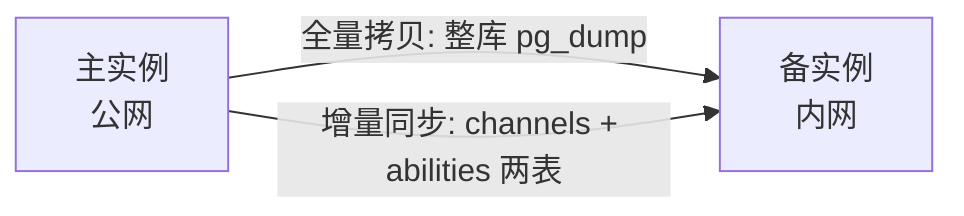
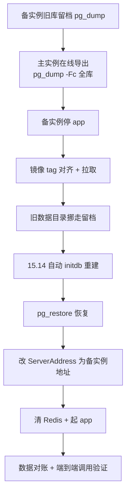

# new-api 数据同步实践：全量拷贝与增量同步

两个 new-api 实例之间做数据同步，前前后后踩了不少坑：先是把整库从主实例拷贝到备实例，跑通后又把需求收敛成"只同步渠道"的增量方案。这篇文章把两套做法、取舍依据和踩坑记录一次写清，所有主机信息已脱敏，核心方法可直接复用。

## 1. 场景与数据模型

先交代背景。我有两个 new-api 实例：一个部署在公网，作为日常配置和使用的**主实例**；一个部署在内网，作为**备实例**。需求分两个阶段：一开始要的是"整库替换"——把主实例的所有数据整体搬到备实例；跑通之后，日常只需要"渠道单向同步"——主实例改了渠道配置，备实例跟着变，其他数据各管各的。

同步前先看清数据分布。new-api 的状态基本都在 PostgreSQL 里（业务库一共 37 张表：用户、渠道、令牌、日志、系统设置、兑换码、模型倍率等），Redis 只是缓存（渠道/模型列表、限流计数），本地目录放日志和少量文件。这个分布决定了同步的主战场就是 PG 里的那几张表。

## 2. 全量拷贝（整库重建）

### 2.1 方式取舍：逻辑迁移 vs 物理拷贝

整库替换有两条路：逻辑备份（pg_dump/pg_restore）或物理拷贝数据目录。我选了逻辑迁移：

| 维度 | 逻辑迁移（pg_dump） | 物理拷贝（数据目录） |
| --- | --- | --- |
| 源实例停机 | 不需要，在线一致性导出 | 通常要停 PostgreSQL |
| 数据量敏感度 | 小库秒级 | 多大就拷多久 |
| 版本兼容 | 同大版本即可（15.x 互导） | 二进制版本必须接近 |
| 干净度 | 重建的表更干净 | 会把 WAL、历史文件一并搬过去 |

业务库只有 11 MB（大部分是系统固定开销，真实数据很少），逻辑迁移几十秒完成，源实例全程无感知——没有理由用物理拷贝。

### 2.2 迁移范围界定

整库拷贝不等于"什么都搬"。要分清哪些跟库走、哪些不跟库走：

**跟库走**：用户（含管理员密码哈希）、渠道（含全部高级配置：请求头覆盖、参数覆盖、多 Key）、令牌、兑换码、日志、系统设置（options 表）、模型倍率——也就是业务库 37 张表的全部内容。

**不跟库走**：
- 数据库实例凭证：两端的 PostgreSQL 超级用户各管各的，连接配置不动；
- Redis 数据：迁移后必须清空重建，否则陈旧的渠道/模型缓存会捣乱；
- 本地文件目录：业务数据全在 PG，日志目录不需要搬。

有两个行为变化要提前知道：一是迁移后**备实例的登录账号变成主实例的账号**（密码哈希随库走），备实例原有账号作废；二是系统设置里的 ServerAddress 会带着源实例的地址过去——只影响页面生成的链接，不影响 API 调用，但**必须改回备实例自己的访问地址**，否则页面上生成的链接全是错的。

### 2.3 关键准备：留档、版本对齐、数据目录重建

动手前先备好退路，三样回滚资产：迁移前先给备实例的旧库做一次 pg_dump 留档（传异地保存）、旧数据目录整体改名保留、compose 文件留备份。

版本对齐容易被忽略。检查两个实例的镜像 tag，发现只有应用镜像是一致的，PostgreSQL 和 Redis 都是**浮动 tag**（`postgres:15`、`redis:alpine`），这意味着哪天拉一次镜像就会悄悄升级。既然要重建，干脆全部 pin 死，和源实例完全一致：

| 组件 | 对齐后 tag |
| --- | --- |
| new-api | `calciumion/new-api:v1.0.0-rc.34` |
| PostgreSQL | `postgres:15.14` |
| Redis | `redis:8.10.1-alpine` |

pin 到 15.14 之后带出一个隐藏问题：备实例现有的数据目录是浮动 tag 当时实际拉到的 15.17 版本初始化的，**用 15.14 的二进制去跑 15.17 的数据目录是"降级运行"**，不受支持且有风险。所以数据目录也要干净重建——旧目录挪走留档，让 15.14 镜像启动时自动初始化一个新的。

### 2.4 执行步骤

几个执行细节：
- 导出用 custom 格式（`-Fc`），配合 `--no-owner --no-privileges`，避免 owner 权限问题；
- 恢复前先 `TRUNCATE` 或重建库，保证干净；恢复后把自增序列对齐到最大 id，防止后续新建记录撞主键；
- 恢复完成后先改 ServerAddress 再启动 app，避免 option 缓存让修改失效。

### 2.5 验证

验证不能只看"没报错"：
- **数据对账**：两端表数量、关键表行数（用户/渠道/令牌）逐一对比，37 张表、渠道数、令牌数完全一致；
- **端到端调用**：拿主实例的令牌直接调备实例的接口，能正常拿到模型回复才算通——整库拷贝的意义就在这：**令牌两端通用**。

## 3. 增量同步（渠道单向同步）

整库跑通后，日常需求收敛成：**只同步渠道，其他数据各管各的**（令牌、日志、系统设置都留在各自实例）。

### 3.1 同步对象：为什么是两张表

渠道配置在 `channels` 表，但渠道调度还依赖一张物化表 `abilities`——它把每个渠道按"分组 × 模型"展开成行（4 个渠道能展开成 29 行），记录每个分组下哪些渠道可用、优先级和权重是多少。

关键点：**SQL 直写 channels 表不会自动重建 abilities**。两个选择：调官方修复接口让应用重建，或者直接把 abilities 表也一起同步。我选了后者——主实例的 abilities 就是正确答案，整表搬过来，不需要修复接口，也不需要任何管理凭证。

### 3.2 同步机制

一个脚本完成的单向镜像：

1. 主实例在线导出两张表（`pg_dump --data-only -t channels -t abilities -Fc`，不停机）；
2. 传到备实例，停 app（约 10 秒窗口）；
3. `TRUNCATE` 两张表 → `pg_restore --data-only` 恢复；
4. 自增序列对齐到最大 id；
5. 起 app、清 Redis 缓存。

### 3.3 镜像语义与边界

同步是**单向镜像**：主实例是唯一配置源，备实例的渠道表完全等于主实例的快照。主实例加了渠道，同步后备实例跟着加；主实例禁用了某渠道，备实例跟着禁用；**备实例自己建的渠道会被清掉**——如果哪天想在备实例单独加渠道，要么接受这个语义，要么改成"只增改不删"模式。

另一个边界：**两端 new-api 必须 schema 同版本**。以后升级要两个实例一起升，否则表结构漂移，同步会失败。

### 3.4 触发方式

按需手动触发：改完主实例的渠道，跑一次脚本，全程约十几秒，中断只有备实例 app 重启的那 10 秒。

## 4. 踩坑记录

### 4.1 pg_restore 不能从管道读 custom 格式

用 `pg_restore --list` 校验 dump 时，直接往 stdin 喂文件（`docker exec -i ... < dump`）报错。custom 格式归档的 `--list` 和部分操作**要求可随机访问的文件**，不能从管道读。正确姿势是先把 dump 拷进容器落盘（`docker cp`），再对文件路径执行 pg_restore。

### 4.2 浮动 tag 的隐式升级与降级运行

`postgres:15` 这种浮动 tag，拉镜像时实际版本可能已经漂移（15.14 → 15.17）。更隐蔽的是数据目录版本：**旧小版本二进制跑新小版本初始化的数据目录，是降级运行**。处理办法就是前面说的：pin 死 tag + 数据目录跟着重建。

### 4.3 ServerAddress 随库搬家

options 表是系统设置的一部分，整库迁移时会把源实例的 ServerAddress 一起带过去。如果目标实例有自己的访问入口，**恢复后、启动前**先改掉，不然页面上生成的链接全指到源实例。

### 4.4 伪故障教训：手动操作失败 ≠ 系统坏了

收尾往异地备份通道传留档文件时，我手动构造的上传路径少了一层，返回 404。我没有先验证"现状是不是真的坏了"，直接断定"通道结构变了"，还动手改了公共备份脚本——结果脚本本来就没错，是我路径写错了。虽然及时回滚、用真实执行验证了备份链完好，但这个教训值得记：

**单次手动操作的失败不能作为改代码的依据，先验证现状，再动手。以真实执行为判据。**

## 5. 小结

| 需求 | 方案 | 适用场景 |
| --- | --- | --- |
| 整库替换（全量拷贝） | pg_dump 逻辑迁移 + pg 数据目录重建 | 一次性初始化、灾备重建 |
| 渠道单向同步（增量） | channels + abilities 两表镜像脚本 | 日常配置同步、主备渠道对齐 |

经验一句话：**同步的本质是"明确边界 + 可回滚 + 可验证"**——想清楚哪些数据跟库走、哪些不跟，动手前留好回滚资产，完成后用对账和端到端调用做判据，而不是只看"没报错"。
