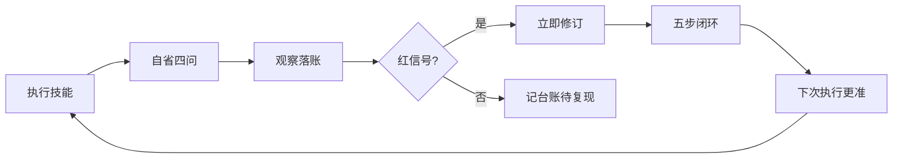

# AI Agent 实战手记 03：让技能越用越好用

技能不是写完就完事的说明书。它在交付那天最贴合实际，之后每用一次，都会积累一点点不贴合，直到某天你发现它给出的判断已经不能用。

这是「AI Agent 实战手记」的第三篇。01 讲工作区规划，02 讲会话交接，管的都是 Agent 身外的环境；这篇讲 Agent 自己身上最容易烂掉的那块——**技能**。

## 1. 痛点：交付即巅峰

技能写出来那天是对的，之后开始漂移。三种典型症状，早晚都会遇到：

- **判断规则误报漏报**。规则只覆盖了当时见过的样本，遇到没见过的就乱报。我曾经一条规则报了 171 条"违规"，其中绝大多数是 `README.md`、`__init__.py` 这种本来就该长这样的文件。
- **文档与实现脱节**。SKILL.md 写着参数默认值 A，脚本里其实是 B；或者文档描述的功能早就被改掉了。这种漂移最阴险，因为它不报错，只是让你对工具的判断失真。
- **噪音堆积**。输出越长越没人看。报了一堆不痛不痒的条目，真正重要的那条就被淹了。

为什么没人改？因为技能被当成**成品**，而不是**代码**。改它的成本看不见，收益也看不见，于是每次不爽都忍过去，忍到某天干脆弃用重建。

一个真实的教训：我给一个工作区体检技能写了条规则，用 `core.*` 通配符匹配崩溃转储文件。跑起来一切正常，直到某次扫描把一份真文档 `core.md` 判成了垃圾——它差一点跟着十几条缓存一起被清掉。

如果这个教训只留在对话记录里，下次重建技能我还会踩。这就是自省的起点。

## 2. 关键经验：装一个自省回路

### 2.1 复盘即执行的一部分

把"完成一次工作"重新定义：**做完事 + 复盘**。它不是一个额外流程，也不需要单开一轮对话，执行完当场花两分钟就够。

关键是把它写成技能文档里的**强制步骤**，而不是"有空可以想想"。写在 SKILL.md 里的东西才会被执行，飘在脑子里的念头不会。

### 2.2 自省四问

固定四个问题，照着问，别自由发挥：

1. **描述-实际一致性**：技能里写的行为和实际表现一样吗？参数、路径、输出、退出码、阈值，逐项对。
2. **误报漏报**：有没有不该报的报了、该报的没报？
3. **噪音**：分类、级别、措辞、阈值合理吗？产出的东西真有人看吗？
4. **意外**：有没有报错、变慢、护栏被绕过、安全风险？

四问的好处是它逼你从"这次挺顺的"走到"具体哪一条不顺"。没产出可执行条目的自省，等于没自省。

### 2.3 观察要有账本

发现先落账，别急着改。每个技能配一份自省日志，和更新日志分工：

```text
skills/<技能名>/
├── SKILL.md        # 说明书（含「自省与自我更新」章节）
├── LEARNINGS.md    # 自省日志：观察到什么、为什么
└── CHANGELOG.md    # 更新日志：最终改了什么
```

日志三块内容：**执行记录表**（编号、日期、触发、结果）、**观察台账**（编号、分类、观察、处置、状态）、**规则沉淀**（一句话原则）。观察状态只有三种：已修订、观察中（带复核期限）、待验证。

### 2.4 红黄信号分级

不是所有发现都值得立刻动手：

- 🔴 **红信号**：误删风险、脚本崩溃、护栏失效 → 立即修订，不等累积。
- 🟡 **黄信号**：噪音、阈值、分类、措辞、体验 → 先记台账，**同类第 2 次或累积 3 条再改**。

为什么不一有感觉就改？因为单点感受经常是噪音，重复出现才是模式。每次都改，技能会跟着你当天的心情漂移，最后谁也不知道它为什么长这样。

### 2.5 修订五步闭环



五步是：改政策区（单点修改，别散落多处）→ 同步文档 → 沙箱自测 → 更新两份日志 → 同步 SKILL.md 的描述。

第三步容易被省，也最不能省。**先在沙箱造数据跑通，再碰真实环境**——技能的自我进化一旦出错，它会在你所有技能调用里持续犯错。

### 2.6 五条护栏

自我进化最大的风险是进化成自我退步。所以护栏要写在技能里，任何时候不许违反：

1. **白名单只加不减**：受保护的资产只会更多，不会更少。
2. **删除判定只收敛不放宽**：`core.*` 的教训，判定模式宁可窄不可宽。
3. **知识资产永不改**：日记、笔记、台账这类沉淀只增不改，历史记录不改写。
4. **先沙箱后真实**：改完先在临时目录造数据验证。
5. **改动必须留痕**：两份日志都要写，禁止静默改行为。

## 3. 具体操作：怎么落地

### 3.1 技能加两样东西

新建技能时就在模板里放两样：SKILL.md 里的「自省与自我更新」章节、空的 LEARNINGS.md。章节按上面的四问、分级、五步、护栏写，一百来字就够。

现成技能也一样，补上就行。真正的工作量在第一次复盘——第一次往往能挖出好几条历史遗留问题，之后每次就只剩一两条。

### 3.2 自省提示词

可以直接复用的一段话，贴给 Agent 就能跑：

```text
本次 <技能名> 执行完毕。按复盘四问自省：
1) 技能描述与实际行为是否一致（参数/路径/输出/退出码/阈值）
2) 本次有没有误报、漏报
3) 分类、级别、阈值、措辞有没有噪音
4) 执行本身有没有报错、变慢、护栏被绕过、安全风险

发现记入 LEARNINGS.md（含证据与状态）。红信号立即修订；
黄信号先记，同类第 2 次或累积 3 条再改。确需修订的走五步闭环
（改政策区 → 同步文档 → 沙箱自测 → 更新日志 → 同步 SKILL.md），
全程遵守五条护栏。
```

### 3.3 挂到周期任务上

周期任务里把自省和主任务并列，不另开轮次。比如一个每周跑的工作区体检：

```text
- 运行工作区扫描脚本（--quiet，只保留最近 12 份报告）
- 读最新报告的「与上次对比」段，只在出现新增问题时简报
- 顺带技能自省：四问复盘本次执行，观察记入 LEARNINGS.md
```

周期任务本来就定期发生，顺手复盘的成本几乎为零；而"定期"意味着同类问题很快会凑够第 2 次，黄信号自然升级成该修的东西。

## 4. 一次真实的自省记录

技能建好当天我就跑了第一轮，台账长这样（脱敏）：

| 编号 | 分类 | 观察 | 状态 |
|---|---|---|---|
| O001 | 安全 | 通配符把真文档误判为垃圾，险些批量清掉 | ✅ 已修订 |
| O002 | 噪音 | 一条规则单次报出 171 条无关条目 | ✅ 已修订 |
| O003 | 误报 | 版本库内的脚本被归为"备份资产"，报了没用 | 🟡 观察中 |
| O004 | 体验 | 某个参数默认值容易忘配，报告自己变成垃圾 | 🟡 观察中 |
| O005 | 流程 | 前四条观察全来自技能**创建期**，不是第一次执行 | ✅ 已沉淀规则 |

O005 是自省自己的自省：技能创建期的踩坑如果不当场落账，交付后就被遗忘了。于是多了一条规则——**创建即自省**。

## 5. 容易踩的坑

### 5.1 变成自我表扬

只写"本次执行顺利、结果符合预期"，这不是自省。判断标准很简单：**这轮复盘产出了可执行条目吗**？没有就重来。

### 5.2 每次执行都改

改得太勤，技能就开始漂移。黄信号先记账、等复现；观察中的条目要写复核期限（比如一个月），到期仍成立才动手。

### 5.3 只改实现不更文档

文档-实现脱节本来就是自省要找的第一号问题，结果改完实现忘了改描述，自己制造一条。改实现必须同步 SKILL.md。

### 5.4 没有护栏的进化

把白名单改小、把删除判定放宽，短期看着"更灵活"，长期就是把技能往危险的地方推。护栏要写成硬约束，宁可少改也不破例。

### 5.5 日志只增不结

台账只记不结，一年后又是一堆垃圾。已修订的归档、观察中的带期限、过期的清掉——自省日志自己也要被自省。

## 6. 小结

三句话收尾：

- 技能不是成品，是**代码**；它需要反馈回路，而不是靠回忆。
- 回路很短：执行 → 四问 → 落账 → 分级 → 修订 → 下次更准，一次两分钟。
- 护栏比自由重要：能自我进化的技能，也必须能被约束住。

01 立规矩、02 交接、03 自省，三个动作管的是三个不同层面的东西——工作区、会话、技能本身。它们共享同一个前提：Agent 的长期表现不取决于某一次的发挥，而取决于它有没有把每次执行的经验沉淀下来。

技能的寿命不由写它那天决定，而由每次复盘决定。
