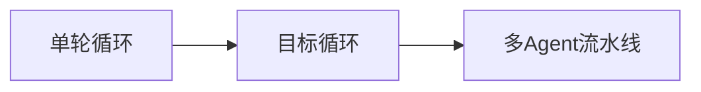

# AI Agent 实战手记 04：给 Agent 选对 Loop 工作方式

同一个 Agent，为什么你只是聊聊天，别人却能让它通宵改完 40 个测试？差别通常在它的"工作方式"——专业点叫 Loop（循环）。上篇我们聊过权限模式（能动什么），这篇讲另一条线：循环方式（跑多远、怎么跑）。它决定 Agent 是回一句话就停，还是一轮一轮干到任务完成。

## 1. 什么是 Loop 工作方式（What）

### 1.1 一次循环是什么

Agent 最小的工作单位是"思考 → 调用工具 → 拿到结果"，这算一次迭代（loop iteration）。普通对话里，Agent 回你一句就停；Loop 工作方式决定四件事：

- **跑几轮**：一次就停，还是持续到完成。
- **怎么跑**：单个 Agent 自己循环，还是多个子 Agent 分工。
- **怎么停**：说完就算完，还是证明完成才算完。
- **花多少**：迭代上限、Token 预算、重复检测。

### 1.2 三种典型循环



- **单轮循环**（ReAct）：想一步做一步，适合问答和小修小补。
- **目标循环**：设一个目标，Agent 自己多轮迭代直到完成，带自我审计。
- **多 Agent 流水线**：任务拆成子任务，master 派活、worker 干活、verifier 验收。

先分清两件事：循环方式（跑多远、怎么跑）和权限模式（能动什么、问不问）是**两个正交维度**，各选各的。别把权限模式当工作方式用。

## 2. 为什么要划分 Loop 工作方式（Why）

### 2.1 单轮循环干不完长任务

"修复所有失败的单元测试"这种任务，一次回复根本不可能完成，必须让 Agent 持续调研、修改、验证、再修改。划分循环方式的第一意义：让 Agent 能跑完一个任务，而不只是回答一句话。

### 2.2 无限循环烧钱烧时间

让循环无限制跑，Token 会被烧穿。所以框架要提供迭代上限、Token 预算、重复行为检测——比如检测到 Agent 反复调用同一个工具、传相同参数，先提示它换个思路，严重时强制停止。

### 2.3 "觉得完成了"不等于完成了

普通对话里 Agent 输出一段文字就算完事；目标循环里它必须自我审计——跑测试、查文件，找出实际证据证明目标达成，没有证据的项一律视为未完成。这层机制把"它说做完了"升级成"它证明做完了"。

### 2.4 长任务的信息会腐烂

一个 40 步的大任务，做到后面 Agent 早忘了前面说过什么。多 Agent 流水线用上下文隔离解决：每个 worker 只关注自己的子任务，不被其他任务的信息干扰。

## 3. 主流框架的 Loop 模式设定（清单）

以下截至 2026-09，以官方文档为准。先看两个具体框架，再看背后的通用范式。

### 3.1 QwenPaw：默认 / Goal / Mission

QwenPaw 把这套机制叫"循环工程"（Loop Engineering），三等模式：

| 模式 | 进入方式 | 循环行为 | 适用 |
|------|----------|----------|------|
| 默认（普通对话） | 直接聊 | 一轮即停 + 循环保护 | 问答、小修 |
| Goal（目标循环） | /goal <目标> | 单 Agent 持续迭代，自我审计证明完成 | 目标明确的持续任务 |
| Mission（任务流水线） | /mission <任务> | master → worker → verifier 多 Agent | 大型多子任务项目 |

默认模式也有循环保护：迭代上限（默认 50 次）、重复行为检测（先注入提示换思路，严重则强制停）、完成度检查（Agent 只输出文本不调工具时，自动提醒它确认任务是否真完成）。

Goal 模式会自动启用三个专用工具：`get_goal`（查进度、迭代数、Token 用量、剩余预算）、`update_goal`（标记 complete 或 blocked）、`create_goal`（按需创建新目标）。停止条件：目标完成（有证据）、遇到阻塞、迭代用完（默认 20）、Token 预算耗尽（默认 30 万）、你手动停止。

Mission 模式分两阶段：Phase 1 先生成 PRD、把任务拆成用户故事，你确认后进入 Phase 2；Phase 2 里 master 把故事派给 worker 独立实现，verifier 独立验收，未通过的自动重试。可用 `/mission status`、`/mission list` 看进度。

Loop 参数在 Console「运行配置 → 智能体 Loop 设置」里调，预设"默认 / Goal / Mission"三套模板，对应 `agent.json` 的 `running.loop`：

```json
{
  "running": {
    "loop": {
      "iteration": { "enabled": true, "max_iterations": 50 },
      "doom_loop": { "enabled": true, "window_size": 6, "similarity_threshold": 0.8 },
      "rubric": { "enabled": false, "max_interventions": 1 }
    }
  }
}
```

### 3.2 DeepSeek Harness：标准 / PTC / 极简 / 创造

DSH（2026-08 开源，"一切皆插件"）在输入框上方有模式选择器，四种模式：

| 模式 | 循环方式 | 特点 |
|------|----------|------|
| 标准 | 经典工具循环：调一次工具 → 拿结果 → 再决定 | 完整工具集（文件/Shell/搜索/Skills/计划/目标/子 Agent/工作流） |
| PTC（Code 模式） | 模型写一段 TypeScript，一次 run_code 组合多步工具调用 | 拥有标准全部能力，省模型-工具往返、省 Token |
| 极简 | 最小循环：持久 Bash + 文件编辑器 | 提示词固定"你是有帮助的软件工程助手"，去上下文压缩，基准测试专用 |
| 创造 | 标准能力 + 运行时检查 | 现场试插件、组合成新模式，Agent 可以给自己造工具 |

PTC 的收益很直观：原来读文件 → 搜索 → 筛选 → 并行调用 → 整理结果可能要五次模型往返，有机会压进一次程序执行；代价是要求模型有稳定的代码规划能力，调试难度高，小白先别碰。

### 3.3 通用循环范式：一张坐标系

两个框架的模式背后是几种通用范式，理解了范式换框架就不慌：

| 范式 | 特征 | 代表 |
|------|------|------|
| ReAct | 推理 → 行动 → 观察，一步一循环 | DSH 标准、QwenPaw 默认 |
| Plan-and-Execute | 先出计划再执行 | QwenPaw Goal |
| 反思 / 自我审计 | 每轮对照验收标准找证据 | QwenPaw Goal 的完成判定 |
| 程序化编排 | 用代码组织多步工具调用 | DSH PTC |
| 多 Agent 流水线 | 拆用户故事，派活-干活-验收 | QwenPaw Mission |

## 4. 谁该用哪档，何时切换（Who / When）

### 4.1 决策四问

1. 一句话能说清任务吗？能 → 默认；不能但目标明确 → Goal；能拆成多个独立子任务 → Mission。
2. 任务要跑多久？几分钟的小修 → 默认；几十分钟的执行链 → Goal 或 PTC。
3. 模型靠得住吗？模型规划代码能力一般 → 别上 PTC，先走标准 / Skill；能力强才跑得动 PTC / Mission。
4. 有没有人在旁边盯？后台无人值守 → 先设预算上限再上 Goal / Mission；有人盯 → 随时打断。

### 4.2 场景映射表

| 场景 | 推荐模式 |
|------|----------|
| 快速问答、改个文案 | 默认 |
| 修复全部失败测试、翻译文档、生成调研报告 | Goal |
| 从零搭一个完整项目、多模块功能 | Mission |
| 多步且结构化的批量操作（读 → 搜 → 筛 → 写） | PTC |
| 对比两个模型的裸能力 | 极简 |
| 想造一个新 Agent / 新插件 | 创造 |

### 4.3 一个任务的循环旅程

"给项目加 CI"：先用默认模式聊需求 → Goal 模式让它持续写配置、跑测试 → 卡住就拆成 Mission，让各模块 worker 并行改 → 最后 verifier 验收。任务越大，模式越重；一个任务里换两三次模式很正常。

## 5. 在哪里设置和切换（Where / How）

### 5.1 切换方式一览

| 工具 | 怎么切 | 查看状态 |
|------|--------|----------|
| QwenPaw | /goal <目标>、/mission <任务> | /mission status、/mission list |
| QwenPaw Loop 参数 | Console 运行配置 → 智能体 Loop 设置 | agent.json 的 running.loop |
| DSH | 输入框上方模式选择器 | 轨迹视图（只追加事件日志） |

### 5.2 一个可直接复制的开工指令

```text
用 Goal 模式推进：目标是 <任务描述>。
先给我一份执行计划，然后持续工作直到完成。
每完成一个里程碑用一句话汇报；
只有当你找到实际证据（测试通过 / 文件存在）时才标记完成。
```

### 5.3 验证三连

1. 它真跑了几轮吗？默认模式说一句话就停，是没进循环。
2. 它说完成时有证据吗？Goal 模式应该有测试、文件佐证。
3. 预算还够吗？用 get_goal 或 /mission status 查。

## 6. 常见翻车姿势

### 6.1 拿默认模式跑长任务

一句话让 Agent"实现整个功能"，它回一段代码就停，你以为是全部。长任务请显式进 Goal / Mission。

### 6.2 Goal 不设预算

目标循环默认 30 万 Token，复杂任务可能烧穿；先设预算，别让它自己跑通宵。

### 6.3 杀鸡用牛刀开 Mission

给个小任务开 Mission：PRD、多 Agent、验证流水线，光协调开销就回不了本。

### 6.4 模型不行硬上 PTC

模型代码规划不稳，run_code 写出来的编排全是 bug，调试成本比省下的 Token 更贵。先标准模式验证模型，再考虑 PTC。

### 6.5 拿极简模式日常用

极简模式只有两个工具，没有 Skills、没有搜索，适合基准测试，不适合干活。

### 6.6 把循环方式当权限模式

两个维度别混：循环方式管"跑多远"，权限模式管"能动什么"。该用 Goal 的只开了 yolo（全自动权限却只有单轮循环），该问的没问，两头都容易出事。

## 7. 小结：选循环三句话

1. 任务越大模式越重：一句话 → 默认，有目标 → Goal，多个子任务 → Mission。
2. 工具调用越密集越值得 PTC：多步结构化操作压进一次程序执行；模型规划能力不够别碰。
3. 跑之前定预算、跑完查证据：迭代上限和 Token 预算先设好，完成判定看证据，不看"我觉得"。

数据来源：QwenPaw 官方文档「循环工程」、DeepSeek Harness 官方介绍与开发者文档，核对时间 2026-09。