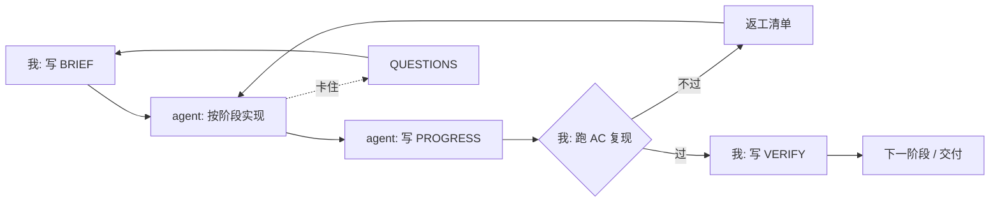

# 给 AI 派活：四份文档与一套验收标准

最近我把一整套开发活交给了一个 AI agent 干：9 个阶段、28 条验收标准、130 个自动化测试，前后几十次提交。整个过程里没有一句"你去写个 X 吧"式的口头指令，所有约定都躺在磁盘上的四份文档里。

这篇把这套方法和里面的术语讲清楚。它不需要什么高级工具，你手上有任何一个能执行命令、能写文件的 agent 就能用。

## 1. 为什么需要一套文档

### 1.1 它不记得你

跟 agent 协作，第一个要接受的事实是：**它不记得你**。

每次会话它都是重新醒来，上一次聊过什么、你定过什么规矩，只要没落进磁盘，就等于没发生。你昨晚花了二十分钟跟它讲清楚的接口命名规范，第二天开新会话，它一无所知。

这跟带新人的感觉有点像，但差别在于：新人会记，而且新人第二天还在。agent 是"每天都是第一天的同事"。

### 1.2 压缩与换会话

比"换会话"更隐蔽的是**上下文压缩**。会话太长时，宿主会把较早的对话内容交给模型做一次摘要，用摘要替换原文，腾出空间继续干。

我实测到的行为：

- 上下文窗口 100 万 token，**大约用到 80% 时触发压缩**，压完回落到阈值以下；
- 被压掉的消息并没有删除，只是被"遮蔽"（日志里还在，模型看不到了）；
- 摘要由模型生成，**是有损的**——你写在对话里的细节，不一定还在里面。

所以"跟它聊着聊着把规矩聊清楚"这条路线不可靠。真正可靠的是：**规矩写在文件里，会话只用来下指令和收结果。**

顺手给一条实操建议：**大阶段开工前换一个新会话**，上下文用量超过 85% 就别再开新阶段了。只要状态都在文件里，换会话的成本几乎为零。

## 2. 四份文档各管一段

### 2.1 谁写谁读

四份文档，每份有明确的作者和读者，这是关键——不混岗，就不会出现"到底谁说了算"的问题。

| 文件 | 谁写 | 谁读 | 管什么 |
| --- | --- | --- | --- |
| `BRIEF.md` | 我 | agent（只读） | 需求合同：做什么、不做什么、接口契约、验收标准、已定决策 |
| `PROGRESS.md` | agent | 我 | 施工日志：干了什么、失败与通过的原始输出、自行判断的细节、下一步 |
| `QUESTIONS.md` | agent | 我 | 卡点上报：规格没覆盖到的决策，写在这里然后**停手**，不许猜 |
| `VERIFY.md` | 我 | 用户 | 验收报告：逐条验收结果、过程审查、缺口与返工项 |

`BRIEF.md` 里我会写一句硬话：**"本文件由我维护，agent 不得修改"**。因为需求一旦可以被实现方随手改，验收就失去了基准。

### 2.2 别混岗

两张表之外，还有两条规矩值得抄：

- **agent 不准碰规格文件**。它可以读 `BRIEF.md`，但不能改；发现规格有问题，写 `QUESTIONS.md` 请示。
- **验收方不准顺手改代码**。我作为验收方，只跑命令、看证据；为了让某条验收通过而亲自去改它的代码，等于自己给自己发合格证。

整个循环长这样：



## 3. 那堆缩写

这些编号不是摆样子，它们各自回答一个不同的问题。

### 3.1 FR 与 AC

**FR（Functional Requirement，功能需求）** 回答"要有什么"。我会把它编号、分级：P0 是这次必须交的，P1 有余力再说，P2 明确不做。

举几个真实的例子：`FR-6 全文检索`、`FR-19 使用记录`、`FR-11b 导入二次确认`。

**AC（Acceptance Criteria，验收标准）** 回答"怎么算做完了"。它是判分标准，也是我认为整套方法里最值钱的部分，后面单独用一节讲。

### 3.2 D 与 T

**D（Decision，已定决策）** 是"不要再问"的清单。技术栈、端口、检索语义、组件库选型，凡是我已经拍板的，都写成 `D-1`、`D-2`……并附一句理由。

这解决两个问题：它不会反复来问同一个问题；也不会自作主张换掉一个已经定好的东西。

**T（To-be-decided，待定项）** 反过来，是需要人拍板的事。我写规格时遇到"必须由用户决定"的，就挂成 `T-1`、`T-2`，等一句话。比如"这套服务只在内网用，还是内外网都要部署"，这种问题我替它猜没有意义。

### 3.3 Q 与 FIX

**Q（Question）** 是 agent 的提问，写在 `QUESTIONS.md` 里，编号 `Q-1`、`Q-2`。规矩是：**提完就停手**，不许带着未决问题继续往下写——否则它一路猜下去，验收时你要连着改十几处。

**FIX（返工项）** 反过来是验收不过时我给的清单，要求精确到"文件/行为 + 期望 + 实际"。

这套东西在业界的对应物大概是：`BRIEF` 像 SRS/PRD，`AC` 像验收测试，`D` 像架构决策记录（ADR），`T` 像风险登记册，`VERIFY` 像 QA 报告。只不过读者是 agent，所以要求更死板。

## 4. AC 怎么写才有用

### 4.1 命令加期望输出

一条好的 AC 只有一个形状：

```text
命令：curl -s -o /dev/null -w '%{http_code}' http://127.0.0.1:8080/healthz
期望：200
实测：（agent 自己填）
```

坏例子是"功能可用""界面正常"。坏在两点：**没法复跑**，也**没法判分**。

好例子有三个好处：

1. **可以复跑**。半年后你怀疑某个功能，把命令抄出来跑一遍就知道，不用问任何人。
2. **可以换人跑**。agent 说"我测过了"的时候，你能自己跑一遍验证——这就是"独立复现"。
3. **能把技术坑钉死**。下面三个真实例子都是这个作用。

### 4.2 三个真实例子

**例一：钉住一个只有两字词才会暴露的坑。**

SQLite 的 FTS5 全文索引有个三元组（trigram）分词器，对中文很友好，但它有个硬下限：**查询词少于 3 个字符必然返回 0 命中**。而中文里两字词太常见了，"交接""会话""上下文"全在两字。

所以检索契约被写成：3 个字符以上走全文索引，2 个字符走 `LIKE` 子串兜底。验收标准也就成了两条：

```bash
# 4 个字符，走全文索引
curl -sG --data-urlencode "q=会话交接" http://127.0.0.1:8080/api/prompts | jq .total   # 期望 1
# 2 个字符，必须走兜底路径
curl -sG --data-urlencode "q=交接"     http://127.0.0.1:8080/api/prompts | jq .total   # 期望 ≥2
```

如果不写第二条，实现方很可能只做全文索引——测试全绿，用户第一次搜两字词就傻了。

**例二：钉住"不许有副作用"。**

"使用记录"这个功能要记下某个 prompt 被取用过几次。听起来无害，但记录写入如果顺手更新了主表的"更新时间"，就会污染版本历史和列表排序。

于是验收标准里有一条：

```text
命令：取用前后各 GET /api/prompts/<id>，比对 version_no 与 updated_at
期望：两次完全相同
```

这类"只读承诺写成可执行断言"的写法，能挡住一整类隐蔽的脏数据。

**例三：钉住"没有数据变化"。**

导入功能支持一种 `replace` 模式（清空重建）。要证明"非法文件不会动数据"，光断言 HTTP 400 不够——得断言数据没变。做法是先给每条用例拍一张"数据指纹"（记录数 + 首条的 id、正文、版本号），跑完再拍一张，两张必须一致。

实测时我用 13 个非法用例跑了一遍，其中两个是"通过应用层校验、靠数据库约束才失败"的（重复主键、重复版本号）——它们同样返回 400 且指纹不变，这就顺带证明了**事务回滚真的生效**。

### 4.3 假绿从哪来

上面这些细节，是因为我被"看起来通过了"坑过好几次。

::: warning 假绿

"命令返回 0 或空" 有两种完全不同的含义：功能没实现，或者**服务根本没起来**。两者在终端里长得一模一样，后者会骗过所有只断言"0 命中"的检查。

我踩过的三种假绿：

1. 验收脚本里忘了给 agent 设管理员口令 → "登录失败"看起来像认证坏了，其实是我自己的夹具没建对；
2. 起服务时用一个展开出来的环境变量前缀（而非 `env VAR=VAL cmd`）→ 服务压根没起，后续 `grep -c` 全是 0；
3. 把起服务失败的诊断输出重定向到了 `/dev/null` → 出问题时眼前只有一串 0，全靠猜。

对策固定成三条：**夹具自检放在脚本第一段**（先断言能登录再往下跑）、**起服务失败绝不隐藏输出**、**看到 0 先怀疑服务没起来**。

:::

## 5. 验收要独立复现

我给 agent 的提示词里有一条死规矩：**验收方只认文件和 git，不认聊天里的自述。**

所以每个阶段结束，我会做三件事：

1. **自己在临时环境跑一遍 AC**，输出原样贴进验收报告。它自己的自检脚本只是对照物，不算证据。
2. **读它的会话日志做过程审查**：跑了哪些命令、有没有跳过测试、有没有"声称做了但实际没做"。日志里的工具调用是逐条记录的，比它的总结可靠。
3. **把它给你的那段收尾回复，逐条对到文件里**。回复里说了、文件里没有的，就是"只存在于聊天"的信息，要单独处置。

第 3 条尤其值得做。实现方给你的漂亮总结，有时候比它落盘的文档多出一点东西——那一点如果重要，就是你下次会话丢失的部分。

举个真实例子：它有一次在回复里说"部署文件无需变化"，我去 `PROGRESS.md` 里搜，发现原话和理由都在；另一次回复里提到的收尾提交号，在文件里必然搜不到——因为它不可能写进自己那次提交。前者说明它落盘了，后者是需要我替它记进验收报告的结构性缺口。

## 6. 阶段门与红绿

把活切成阶段，每段 30～60 分钟量级，每段有自己的验收标准，**过了才进下一段**（这套做法在项目管理里叫阶段门，stage-gate）。

好处是问题暴露得早。累计到第九个阶段才验收，出问题的返工面会大得多。

阶段内部还有一个我很喜欢的机制：**红 → 绿**。要求它先写测试、**先跑出失败**，再实现、再跑出通过，两次输出都贴进施工日志。

```text
✖ tests 3   ℹ pass 0   ℹ fail 3        ← 红：实现还没写
✔ tests 130  ℹ pass 130  ℹ fail 0        ← 绿：实现完成
```

为什么要看"红"那一次？因为它证明这条测试真的在测东西。一条从来没失败过的测试，很可能什么都没测。

顺带说一个副产品：这套东西还抓出过一个单测全覆盖也没发现的缺陷——清空重建时的删除顺序撞上了自引用外键，95 个单元测试全绿，最后是验收脚本的夹具形状（父子目录）把它跑炸的。**夹具的真实形状，比用例的数量重要。**

## 7. 一张速查表

| 缩写 | 全称 | 通俗说法 | 例子 |
| --- | --- | --- | --- |
| FR | Functional Requirement | 要有的功能 | `FR-6 全文检索` |
| AC | Acceptance Criteria | 判分标准 | `AC-27 取用不得改动 updated_at` |
| D | Decision | 已拍板，别再问 | `D-3 检索 = 全文索引 + 短词兜底` |
| T | To-be-decided | 等用户拍板 | `T-1 外网可达性` |
| Q | Question | agent 的卡点 | `Q-1 …` |
| FIX | 返工项 | 验收不过时的整改清单 | 「文件/行为 + 期望 + 实际」 |
| 阶段门 | Stage-Gate | 过了才准进下一段 | 9 个阶段 9 道门 |
| 红绿 | Red-Green | 先看到失败再看到通过 | 先 `fail 3` 后 `pass 130` |

## 8. 代价与边界

最后说几点不吹的地方。

**它比"自己写"慢。** 写规格、写验收标准、每阶段验收，这些都是额外开销。适合的场景是"活比较长、要重复、要交接"——一次性脚本就不值得这么干。

**规格写不清，责任在你。** agent 卡住时写的 `QUESTIONS.md`，十有八九是在替你的含糊买单。我这套跑下来出现过一次规格自相矛盾（要求某个命令"一律走 HTTP 接口"，但验收夹具里没有 HTTP 凭据，等于让它先有鸡才有蛋），是 agent 在开工前把矛盾写出来请我裁决的。**这种情况要改规格，不能改实现去迁就。**

**规矩得跟着走。** 我为此维护了一个技能文档：每次执行完，把这次踩的坑写回去。上面那些"假绿""夹具自检""进程别按路径强杀"的教训，都是这么攒下来的。agent 会忘，文档不会。