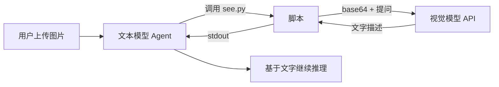

# 给文本模型装上眼睛：用 Skill 委托视觉识别图片

大模型圈有个常见的错位：能力最强的一批开源模型往往是纯文本的，而日常任务里图片又无处不在——用户甩来一张报错截图、一张 UI 稿、一张游戏精灵图，文本模型只能干瞪眼。这篇文章分享一种轻量解法：把"看图"封装成一个 Skill，委托给外部视觉模型完成，让文本模型也能参与图像任务。文末用一次真实的三方对比实验，聊聊这种方案能做什么、不能做什么。

## 1. 问题：文本模型看不见图

先明确"看不见"是什么意思。多模态模型处理图片，是把图像切块编码后直接进入上下文；纯文本模型的上下文里只有 token，图片对它来说就是一段无法解码的字节，或者顶多是一个文件路径。

Agent 框架会尽力把工具结果塞给模型，但图片这一关绕不过去：模型本身支持视觉，这张图才存在；否则就是黑盒。

常规解法有两条路：

1. 换多模态模型。最直接，但意味着更高的 API 成本，或者本地要部署一套视觉模型
2. 上 OCR 工具链。能读出文字，但仅此而已——图里有只猫还是有只狗，UI 长什么样，OCR 一概不知

其实还有第三条路：视觉理解的本质，是"把像素翻译成文字"。既然如此，让一个专门的视觉模型做翻译，文本模型读译文，问题就绕过去了。

## 2. 思路：把"看"委托出去

设计很朴素，一个 Skill = 一份说明书 + 一个脚本：

- 说明书（SKILL.md）告诉文本模型：什么情况下该看图、脚本怎么调、参数怎么传
- 脚本（see.py）负责真正的脏活：读图、编码、调视觉模型 API、把文字结果打印到 stdout

文本模型读到 stdout 里的文字，就等于"看到了"图。整个流程长这样：



这个设计里有三个关键决定：

**输入输出全是纯文本。** 图片对脚本是 base64 或 URL，结果对模型是 stdout 字符串。文本模型全程不需要碰二进制。

**协议用 OpenAI 兼容格式。** 视觉模型的调用就是一个带 image_url 的 chat completion，所以本地 vLLM 起的 Qwen3-VL、云端的 GPT-4o、GLM-4V 都能即插即用，换模型只改一个环境变量。

**零依赖。** Python 标准库的 urllib + base64 + json 就够了，不用装任何 SDK。

## 3. 实现：一个脚本搞定

核心逻辑 50 行以内：

```python
import base64, json, os, sys, urllib.request

def main():
    image_path, question = sys.argv[1], sys.argv[2]
    base_url = os.environ["VISION_BASE_URL"]  # 完整 endpoint
    model = os.environ["VISION_MODEL"]

    if image_path.startswith("http"):
        image_url = image_path  # 远程图直接透传
    else:
        with open(image_path, "rb") as f:
            b64 = base64.b64encode(f.read()).decode()
        image_url = f"data:image/png;base64,{b64}"

    payload = {
        "model": model,
        "messages": [{
            "role": "user",
            "content": [
                {"type": "text", "text": question},
                {"type": "image_url", "image_url": {"url": image_url}},
            ],
        }],
        "max_tokens": 4096,
        "temperature": 0.2,
    }
    req = urllib.request.Request(
        base_url,
        data=json.dumps(payload).encode(),
        headers={"Content-Type": "application/json"},
    )
    with urllib.request.urlopen(req, timeout=120) as resp:
        result = json.loads(resp.read())
    print(result["choices"][0]["message"]["content"])

if __name__ == "__main__":
    main()
```

配置走环境变量，设一次到处用：

```bash
export VISION_BASE_URL="http://localhost:1234/v1/chat/completions"
export VISION_MODEL="Qwen3-VL-32B"
# VISION_API_KEY="sk-..."   # 本地服务可省略
```

用法就是一条命令：

```bash
python3 see.py ./error.png "截图里是什么报错？可能的原因是什么？"
python3 see.py ./chart.png "把图表数据提取成 markdown 表格"
```

两个实践细节值得注意。一是提问要具体——"描述这张图"不如"提取图里所有报错文字"，聚焦的问题能换来更准的答案和更少的 token。二是本地图片会转成 base64 data URL，体积膨胀约 33%，大图先压一遍再传。

## 4. 实测：三双眼睛对比

光说不练假把式。我拿一张 1182×1330 的游戏角色精灵图做了个对比实验：8 列 × 9 行共 72 帧，一个 Q 版银发狐耳角色的全套动画。让三种"眼睛"分别识别，再看谁说得对。

三种方式：

1. **原生多模态**：把压缩后的图直接注入上下文，模型自己看
2. **Skill 委托**：文本模型调 see.py，由外部视觉模型识别
3. **程序化验证**：用 PIL 读 alpha 通道做投影分析，数出行列网格——这是确定性裁判

结果挺有意思：

| 项目 | 原生多模态 | Skill 委托视觉 |
|------|-----------|---------------|
| 行列数 | 8×8（漏数一行） | 9×8 ✓ |
| 移动朝向 | 第 2 行误判朝右 | 两行都朝左 ✓ |
| 特效细节 | 只说"彩色特效" | 明确指出爱心特效 ✓ |
| 图像尺寸 | 1182×1330 ✓ | 猜了个 2048×1792 ✗ |
| 背景类型 | RGBA 透明 ✓ | 含糊的"浅色或透明" |
| 外观与动作语义 | 全对 | 基本全对 |

两个结论：

**委托视觉的结构感知出乎意料地好。** 行数、朝向、爱心特效这些"看图"的活儿，它干得比原生视觉还细。原因也不复杂：外部视觉模型专职看图，而且脚本提问时可以引导它逐行分析。

**但它会理直气壮地幻觉。** 精确像素尺寸这种元数据，视觉上根本无从得知，它张口就编了个整数；原生模型读了文件头所以答对了。凡是元数据级的事实——尺寸、色彩通道、文件大小——代码读一下就是真相，问视觉模型纯属碰运气。

最后程序化验证一锤定音：alpha 通道投影分析给出 8 列 9 行，和逐行裁切目检的结果完全一致。

## 5. 边界与踩坑

这套方案不是万能的，几个坑记下来：

- **上下文注入限制**：Agent 框架往上下文塞图通常有大小上限（比如 2MB），超了要先压缩。Skill 委托路径没这个限制，但有 base64 膨胀和 API 侧的尺寸约束
- **计数是视觉模型的弱项**：数格子、数物体，两种视觉方式都翻过车。这类问题直接写十行代码分析像素，比任何视觉模型都可靠
- **多一跳网络往返**：延迟和成本都多一层，单次调用感知不明显，批量处理要考虑并发和重试
- **说明书质量决定下限**：SKILL.md 里什么时候触发、怎么提问、结果怎么用，写得越具体，模型用得越好

## 6. 现成方案：vision 技能

懒得自己写的话，可以直接用现成的 vision 技能，本文实验用的就是它。它遵循开放的 Agent Skills 规范，一个文件夹就是一份技能：

```text
vision/
├── SKILL.md        # 说明书：触发时机、调用方式、配置说明
└── scripts/
    └── see.py      # 识图脚本，纯标准库实现
```

把它放进 Agent 的技能目录，配置好视觉模型就能用。配置走环境变量，或者写进 .claude/settings.json 的 env 块：

```json
{
  "env": {
    "VISION_BASE_URL": "http://localhost:1234/v1/chat/completions",
    "VISION_MODEL": "Qwen3-VL-32B",
    "VISION_API_KEY": "sk-..."
  }
}
```

注意 VISION_BASE_URL 要写完整的 chat/completions 端点，不是裸地址；本地服务可以不设 API key。

日常使用完全无感：Agent 读到 SKILL.md 后，遇到"看看这张图"、"读一下报错截图"、"识别图片文字"这类请求会自动调用脚本。也可以手动执行：

```bash
# 描述图片
python3 scripts/see.py ./photo.jpg "Describe this image in detail"

# OCR，保留排版
python3 scripts/see.py ./receipt.png "Transcribe all text, preserving layout"

# 远程图片直接传 URL
python3 scripts/see.py https://example.com/diagram.png "讲解这张架构图"

# 只检查请求不实际发送
python3 scripts/see.py --dry-run img.png "test"
```

本地文件自动转 base64，http(s) 链接直接透传，换视觉模型只改两个环境变量。

## 7. 小结

Skill 委托视觉的本质，是承认"文本模型不需要看见像素，只需要知道图里有什么"。一个 50 行的脚本加一份说明书，就能让纯文本模型接入任何 OpenAI 兼容的视觉服务。

实践下来最深的体会是：别指望任何一双"眼睛"全知全能。语义理解交给视觉模型，结构事实交给代码，两边结论打架时，用确定性脚本当裁判——这个混合思路，比纠结"哪个模型更强"实用得多。
