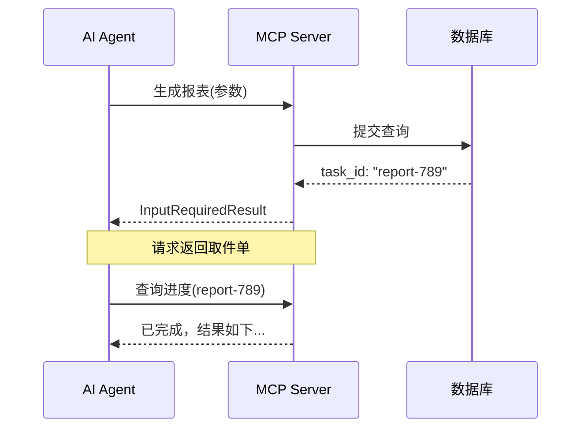

# MCP 协议无状态化：从 Session 黏性到分布式架构的设计演进

如果你做过分布式系统，一定遇到过这个场景：用户登录后绑定在一台服务器上，扩容不敢扩、重启不敢重、一台机器挂了那批用户就掉线。Session 黏性、Sticky Session、Session 复制……每个方案都像在给一栋老楼加电梯——能凑合用，但总归是补丁。

MCP 协议最新版本（2026-07-28）干了一件"看似简单"的事：把整个协议核心从有状态改成无状态。这意味着什么？AI 调用工具时不用再绑死在一台服务器上，每次请求自带身份和能力声明，任意节点都能处理。

这不止是 MCP 的升级，它背后藏着一个经典的系统设计命题：**有状态好，还是无状态好？**

## 1. Session 黏性：曾经"理所当然"的设计

MCP 诞生之初，设计思路很直白：AI 要和某个工具服务器建立连接，然后在这个连接上反复发请求。像极了电话——拨通、说话、挂断，全程独占一条线路。

从技术实现看，这很自然。MCP 使用 `initialize`/`initialized` 握手建立会话，后续所有请求带上 `Mcp-Session-Id` 头，服务器靠这个 ID 识别"这是谁"。

```text
Client → Server: initialize (协议版本, 客户端能力)
Server → Client: initialized (服务端能力, 会话ID)
Client → Server: tools/list (带上 Session-Id)
Server → Client: 工具列表
```

这个模型在本地开发时毫无问题。你的 MCP 客户端和服务器跑在同一台笔记本上，不存在"连到哪台机器"的问题。

但一旦把 MCP 服务部署到云端，事情就变了。

## 2. 上云之后，有状态成了"紧箍咒"

假设你做了一个 MCP 服务，能帮 AI 查询数据库、生成报表。上线后用户量上来，你需要加服务器。

如果协议是**有状态的**，问题来了：

- 新用户请求到了新机器——没问题，建新会话。
- 老用户的下一次请求轮询到了新机器——新机器没有这个会话，拒绝。
- 解决方案：加一层负载均衡会话保持（Session Affinity），把同一用户始终路由到同一台机器。
- 然后某台机器挂了——那台机器上的所有会话瞬间丢失，用户必须重新建连。

分布式系统里，有状态服务的扩容和容灾从来不是"多加几台机器"那么简单。你需要在负载均衡层做 Sticky Session，需要在机器间做 Session 复制，需要引入分布式缓存来共享状态……每加一层，复杂度就翻一倍。

```text
         ┌──────────────┐
         │   Load Balancer  │
         │  (Sticky Session)│
         └──────┬───────┘
                │
    ┌───────┴───────┬───────┐
    │               │       │
┌───▼───┐    ┌───▼───┐   ┌───▼───┐
│ MCP-A │◄──►│ MCP-B │   │ MCP-C │
│(会话1) │    │(会话2) │   │(会话3) │
└───────┘    └───────┘   └───────┘
   ▲ 用户1      ▲ 用户2      ▲ 用户3
   │ 绑死A      │ 绑死B      │ 绑死C
   │ A挂了→     │            │
   │ 会话丢失   │            │
```

这哪是分布式？分明是"分布式的表象，单体化的本质"。

## 3. 无状态化：让每个请求独⽴站稳

MCP 2026-07-28 版本砍掉了 `initialize`/`initialized` 握手机制和 `Mcp-Session-Id` 头。每个请求自包含协议版本、客户端身份和能力信息，通过 `_meta` 字段传递。

```json
{
  "jsonrpc": "2.0",
  "method": "tools/list",
  "params": {
    "_meta": {
      "protocolVersion": "2026-07-28",
      "clientId": "client-abc-123",
      "capabilities": {
        "tools": {},
        "resources": {}
      }
    }
  }
}
```

每个请求都是一次独立的对话。任何一台服务器收到它，都能正确响应。

```text
         ┌──────────────┐
         │   Load Balancer  │
         │  (普通轮询)      │
         └──────┬───────┘
                │
    ┌───────┴───────┬───────┐
    │               │       │
┌───▼───┐    ┌───▼───┐   ┌───▼───┐
│ MCP-A │    │ MCP-B │   │ MCP-C │
└───────┘    └───────┘   └───────┘
   ▲            ▲           ▲
   └────── 用户1 的3个请求 ──┘
   (任意节点处理，没有绑定)
```

这不就是 HTTP 协议的设计思路吗？每个 HTTP 请求都是独立的，服务器不需要记住"上一个请求是什么"。这才是分布式系统正确的基础假设。

## 4. 长任务怎么办？"取件单"模式

你可能会问：请求独立了，但那些需要长时间运行的任务呢？比如 AI 生成一份 1000 页的报表，不可能在单次请求内完成。

新版 MCP 的做法是：工具返回一个**任务编号**（task ID），AI 拿着编号后续查询进度。



状态没有消失——它从"协议层的内置会话"转移到了"业务层的显式任务"。协议不再替你管理状态，你可以在数据库、Redis、或者任何地方存任务进度。换一台机器，拿着任务编号一样能继续。

这其实是一种**关注点分离**：协议管通信，业务管状态。

## 5. 请求中间暂停：AI 终于能"问一声"了

另一个有趣的变化是 `InputRequiredResult`。以前 MCP 工具调用只有两种结果：成功或失败。如果你需要用户补充信息，只能报错。

新版允许工具在调用过程中暂停，向用户提出补充问题，收到回答后继续执行。

```python
# 伪代码：MCP 工具可以请求用户输入
def create_service(region=None, budget=None):
    if region is None:
        return InputRequiredResult(
            question="请选择部署地区：上海、北京、深圳",
            fields=["region"]
        )
    if budget is None:
        return InputRequiredResult(
            question="请输入月度预算（元）",
            fields=["budget"]
        )
    # 信息齐全，继续执行
    return deploy_service(region, budget)
```

这个设计让 AI 工具调用从"全自动"变成了"可交互"。对开发者来说，意味着可以写出更人性化的工具——关键步骤等人确认，而非自作主张。

## 6. 对开发者的实际影响

这次更新对不同类型的开发者影响各不相同：

- **如果你在写 MCP 客户端（AI Agent）**：需要处理 `InputRequiredResult` 和任务状态轮询，不再是简单的"发起请求等结果"。
- **如果你在写 MCP 服务端（工具提供者）**：可以不再操心会话管理，部署架构回归普通的无状态服务。但需要处理显式任务 ID 的生成和状态维护。
- **如果你在维护老版 MCP 服务**：官方承诺至少 12 个月过渡期，但建议尽早规划迁移。核心变化是去掉 `initialize` 流程，改用 `_meta` 传递能力信息。

SDK 方面，TypeScript、Python、Go、C# 的 Tier 1 SDK 都已支持新版。迁移路径比想象中平滑——因为核心逻辑不变，只是传输方式变了。

## 从"电话"到"微信"

用一个比喻来总结这次升级：

旧版 MCP 像打电话——拨通、说话、挂断，整条线路被独占。服务器必须记住"谁在线上"。

新版 MCP 像发微信——每条消息独立发送，对方收到就能处理。服务器不需要记住你，它只需要读懂你发来的这条消息。

分布式系统设计里有一条朴素的原则：**能做无状态就别做有状态**。这不是说状态不好——业务一定有状态，但协议层不该帮你管。把状态推到业务层，协议层保持轻量和无状态，这是 MCP 这次更新最核心的设计哲学。

对开发者来说，这意味着 MCP 服务终于可以像普通 Web 服务一样部署、扩容、容灾了。而对我们这些写代码的人来说，又多了一个值得反复品味的架构案例。