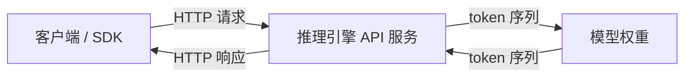
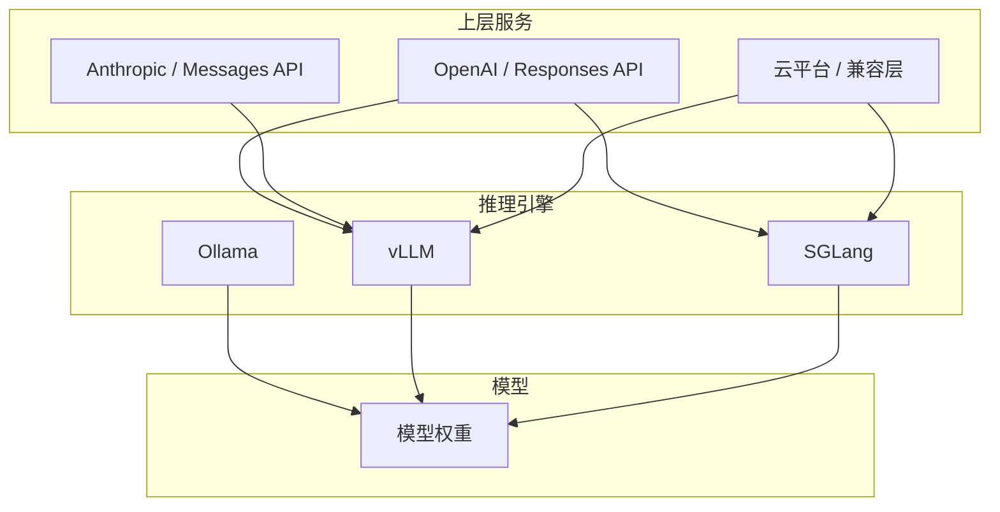

# 模型 API 生态：是谁在提供接口？

用 vLLM 部署 DeepSeek 启动一个服务，终端打印出 "OpenAI Compatible API server started"，然后你用 OpenAI 的 Python SDK 把 `base_url` 改成它的地址，就能直接调用了。

整个过程一气呵成，顺畅得让人忘了问一个问题：**这个 API 是谁提供的？**

是 DeepSeek 模型自带的？是 vLLM 这个推理引擎塞进去的？还是说中间还有别的层？顺着这个问题往下挖，会发现整个 AI 模型 API 的生态远比你想象的有层次。

## 1. 市面上主流的三种 API

抛开各种实现细节，开发者在日常工作中接触到的 API 主要是这三种：

| API | 阵营 | 典型场景 | 设计导向 |
|-----|------|---------|---------|
| **Chat Completions** | OpenAI / 开源界 | 通用 Chatbot、常规文本生成 | 文本对话 (Stateless) |
| **Responses API** | OpenAI / 新代生态 | Codex 代码辅助、Agent 智能体、联网/工具混合生成 | 任务/工具 (Agentic) |
| **Messages API** | Anthropic | Claude 模型的特有高级功能（思考链/缓存） | 模型能力 (Model-specific) |

它们分别解决不同的问题，后面逐一展开。

### 1.1 Chat Completions（事实标准）

这是目前**最通用的接口**，也是整个开源生态的"通用语"。几乎所有推理引擎（vLLM、SGLang、Ollama、TGI）都实现了它。

```python
# Chat Completions API
response = client.chat.completions.create(
    model="gpt-4o",
    messages=[
        {"role": "system", "content": "You are a helpful assistant."},
        {"role": "user", "content": "北京的天气怎么样？"},
    ]
)
```

**设计导向：文本对话，无状态。** 每次请求都要把完整的对话历史塞进 `messages` 数组。多轮对话时，开发者得自己管理这个数组，越拼越长，Token 消耗越来越大。

**工具调用需要手动编排。** 大模型说要调用工具，返回一个 `tool_calls`，你得自己写循环去处理——模型返回工具调用 → 你执行工具 → 把结果塞回 messages → 再请求。这个"循环直到完成"的逻辑全部落在应用代码里。

**优点：** 简单、通用、生态成熟。无论是 OpenAI、Anthropic、Google，还是用 vLLM 部署的本地模型，这个接口的调用方式基本一致——改个 `base_url` 就行。

### 1.2 Responses API（新标准）

OpenAI 在 2025 年推出的新一代接口，吸取了 Chat Completions 和已废弃的 Assistants API 的经验，专门为 Agent 场景设计。

```python
# Responses API
response = client.responses.create(
    model="gpt-4o",
    input="北京的天气怎么样？",
    tools=[{
        "type": "web_search",
        "name": "web_search",
    }]
)
```

**设计导向：任务/工具，Agentic。** 不再是简单的"一问一答"，而是围绕着"完成一个任务"来组织的。

**有状态。** 服务器端帮你管理对话历史，不需要每次把整个 messages 传回去。你只需要传当前输入，服务端自动维护上下文。

**内置工具。** `web_search`、`file_search`、`code_interpreter`、`computer_use` 这些工具都是内置的，API 层面帮你处理整个调用链，不需要手动编排 tool_calls 循环。

**推理保留。** 推理模型的 reasoning 上下文在轮次之间不会丢失，多轮 Agent 对话的质量大幅提升。

**函数定义更简洁。** Chat Completions 的函数参数用 JSON Schema 嵌套在 `parameters` 里，Responses API 直接把 schema 写在 `parameters` 字段顶层。

> OpenAI 说 Chat Completions API 会无限期支持，但新项目——尤其是涉及 Agent、工具调用、多轮任务的——建议直接上 Responses API。

### 1.3 Messages API（Anthropic 专属）

Anthropic 为 Claude 模型提供的 API，与 Chat Completions 类似但有其独特设计。

```python
# Messages API
response = client.messages.create(
    model="claude-sonnet-4-20250514",
    max_tokens=1024,
    messages=[
        {"role": "user", "content": "北京的天气怎么样？"}
    ]
)
```

**设计导向：模型能力驱动。** 表面上跟 Chat Completions 很像，但 Messages API 的独特之处在于它暴露了 Claude 模型特有的高级能力：

- **思考链（Extended Thinking）** — Claude 可以在回答前展示内部推理过程，对数学、逻辑、复杂推理任务有显著提升
- **Prompt Caching** — 对频繁使用的上下文（系统提示、长文档）做缓存，大幅降低延迟和成本，适合 RAG 和大文档处理场景
- **Tool Use** — Claude 原生支持函数调用，但 API 层面做了更细粒度的控制

> 三种 API 不是互相替代的关系，而是**各司其职**。Chat Completions 是"对话界的 HTTP"，Responses API 是"Agent 界的专用协议"，Messages API 是"Claude 模型的能力窗口"。

## 2. 核心问题：API 到底是谁提供的

现在进入本文最核心的问题。

用 vLLM 部署 DeepSeek，启动后你能调用 Chat Completions API。那这个接口能力是 DeepSeek 这个模型自带的，还是 vLLM 这个推理引擎提供的？还是说有别的层在做这件事？

### 2.1 模型本身不提供 API

模型本身只是一个参数文件——一堆权重数值。它没有网络端口，没有 HTTP 路由，没有 JSON 解析能力。

大模型能做的只有一件事：**接收 token 序列，预测下一个 token**。

它不关心你传的是 JSON 还是 Protobuf，不关心你是通过 HTTP 还是 gRPC 调用的，甚至不关心你是用 Python 还是 Rust 在调用它。它只知道 tokens in, tokens out。

### 2.2 推理引擎是"翻译官"

推理引擎（vLLM、SGLang、Ollama 等）负责把模型这个"纯计算单元"包装成一个可服务的网络端点。



推理引擎做的事：

1. **解析 HTTP 请求** — 把 JSON 格式的 messages 拆开
2. **应用模板** — 把 messages 按照模型需要的格式拼成 prompt（ChatML、Llama 格式等）
3. **调用模型推理** — 把 tokens 送给模型，拿到输出 tokens
4. **流式 / 非流式返回** — 把输出 tokens 拼回 JSON 响应
5. **额外功能** — 采样参数控制、工具调用解析、前缀缓存、连续批处理等

所以答案是：**API 是推理引擎提供的，不是模型提供的。**

### 2.3 推理引擎决定支持哪些 API

这个结论引申出一个重要推论：**同一个模型，用不同的推理引擎部署，你能调用的 API 可能不一样。**

```python
# vLLM 部署 DeepSeek
# 可以调用 Chat Completions API ✅
# 不支持 Responses API ❌（这是 OpenAI 上层服务独有的）
# 不支持 Messages API ❌（这是 Anthropic 上层服务独有的）

# Ollama 部署 DeepSeek
# 可以调用 Chat Completions API ✅
# 不支持 Responses API ❌
# 不支持 Messages API ❌
```

模型本身——DeepSeek、Qwen、Llama——并不知道自己是被 vLLM 还是 Ollama 部署的。它只知道"给我 tokens，我吐 tokens"。API 的差异完全来自部署引擎那层。

而 Responses API 和 Messages API 是**上层服务**独有的——它们不是推理引擎能提供的，而是云平台/API 网关层的能力。

### 2.4 还有上层服务

故事到这里还没完。推理引擎之上还有一层：**上层服务/框架**。



这层做的事：

- **API 格式转换** — OpenAI 的 Responses API 在底层翻译成 Chat Completions，再交给推理引擎；Anthropic 的 Messages API 同理
- **多模型路由** — 根据请求中的 model 参数，路由到不同的推理引擎实例
- **认证与计费** — API Key 校验、流量统计、用量计费
- **额外功能** — 速率限制、负载均衡、缓存、日志、思考链展示、Prompt Caching

比如火山引擎、阿里云百炼、硅基流动这些平台，你调用的 API 端点背后可能是：

```
你的请求 → 平台网关 → API 格式转换 → vLLM/SGLang 实例 → 模型权重
```

所以完整的链路是三层：

| 层级 | 角色 | 示例 | 提供什么 API |
|------|------|------|-------------|
| **模型** | 纯计算单元 | DeepSeek、Qwen、Llama | **不提供 API**——只做 token 推理 |
| **推理引擎** | 包装层 | vLLM、SGLang、Ollama、TGI | **Chat Completions**（通用对话接口） |
| **上层服务** | 增值层 | OpenAI 网关、Anthropic 网关、云平台 | **Responses API**（Agent 场景）、**Messages API**（Claude 特有能力）、认证计费路由 |

### 2.5 一个具体的例子

来看一下当你用 SDK 调用不同后端时，底层发生了什么：

**场景一：调 OpenAI 的 Responses API**

```python
client = OpenAI(api_key="sk-...")
response = client.responses.create(model="gpt-4o", input="你好")
```

链路：`openai SDK → OpenAI API 网关（Responses API 层）→ 内部推理引擎 → GPT-4o 模型`

OpenAI 的网关把 Responses API 转换成内部格式，再交给内部推理引擎。这个过程对外完全透明。

**场景二：调 Anthropic 的 Messages API**

```python
client = Anthropic(api_key="sk-...")
response = client.messages.create(
    model="claude-sonnet-4-20250514",
    max_tokens=1024,
    messages=[{"role": "user", "content": "你好"}]
)
```

链路：`Anthropic SDK → Anthropic API 网关（Messages API 层）→ 内部推理引擎 → Claude 模型`

Anthropic 的网关处理 Extended Thinking 的展示、Prompt Caching 的缓存命中，这些是 Messages API 独有的能力。

**场景三：调 vLLM 部署的本地模型**

```python
client = OpenAI(base_url="http://localhost:8000/v1", api_key="sk-...")
response = client.chat.completions.create(model="deepseek", messages=[...])
```

链路：`openai SDK → vLLM HTTP 服务器 → vLLM 推理引擎 → DeepSeek 模型`

vLLM 实现了 Chat Completions 的 HTTP 路由，解析请求，拼模板，调模型。这里只有 Chat Completions，没有 Responses API。

**场景四：调云平台上的 DeepSeek**

```python
client = OpenAI(base_url="https://api.xxx.com/v1", api_key="sk-...")
response = client.chat.completions.create(model="deepseek-r1", messages=[...])
```

链路：`openai SDK → 云平台网关 → API 格式转换 → vLLM 实例 → DeepSeek 模型`

云平台可能把你的请求转成 Chat Completions 格式，路由到某个 vLLM 实例上，然后返回结果。

## 3. 总结

| 问题 | 答案 |
|------|------|
| 三种 API 是什么？ | **Chat Completions**（对话导向，Stateless）、**Responses API**（任务导向，Agentic）、**Messages API**（Claude 特有，思考链/缓存） |
| 为什么要单独提供 Responses API？ | Chat Completions 无状态、工具调用需手动编排，无法满足 Agent 场景 |
| Messages API 特殊在哪？ | 暴露了 Claude 的 Extended Thinking 和 Prompt Caching 等模型级能力 |
| 模型支持哪些 API 谁决定的？ | **不是模型本身决定的。** 模型只做 token 推理，不关心 API 格式 |
| vLLM 提供 API 还是模型提供？ | **vLLM 提供的。** 推理引擎负责 HTTP 解析、模板拼接、采样控制，模型只做推理 |
| 上层服务做了什么？ | API 格式转换（Responses/Messages → Chat Completions）、多模型路由、认证计费、Claude 特有能力透出 |

下次当你用 vLLM 部署一个模型，看到 "OpenAI Compatible API" 的提示时，就知道这背后其实是推理引擎在扮演"翻译官"的角色——把模型纯粹的 token 推理能力，包装成开发者熟悉的 HTTP 接口。

而 Responses API 和 Messages API，则是在这个分层架构的"上层服务"又加了一层抽象，让开发者写 Agent 应用时更省心，或者让 Claude 的特有能力可以被更好地利用。