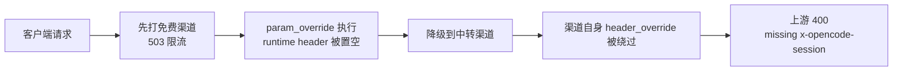

# new-api 网关改写实战：param_override 与 header_override 的两个坑

网关层统一改写请求，是 new-api 这类 API 网关最实用的能力之一：客户端不兼容上游的地方，在渠道上配一次覆盖所有客户端。但这里藏着一个容易被忽略的联动坑——param_override 的执行会悄悄污染请求级的 header 状态，让另一个渠道配得好好的 header_override 全部失效。这篇文章记录两个真实故障的定位过程与配置层修复，第二个尤其值得收藏。

## 1. 背景与渠道拓扑

我们的 new-api 是双机部署：一台公网实例作为唯一配置源，一台内网实例通过脚本单向镜像渠道配置。渠道按「免费优先、付费兜底」的原则排档位：

```text
免费渠道 ×4（priority 110/100/90/80）中转渠道 ×2（priority 50/40）付费兜底渠道 ×1（priority 30，仅全挂兜底）
```

全局开启失败重试（RetryTimes 大于 0），并且四个免费渠道把上游 429 映射成 503，让限流错误进入可重试范围，实现「先打免费档，失败逐级下探」的链路。

## 2. 故障一：客户端传了不认参数

### 2.1 现象

某个客户端（下文称客户端 A）请求 deepseek-v4-flash，只要路由到免费渠道就必然失败，但同一模型换其他客户端却正常。new-api 日志给出了决定性证据：

```text
channel error (channel A, status code: 500): field ReasoningEffort invalid,
should be one of: low, medium, high, xhigh, none
```

报错来自免费上游的参数校验：它只接受 `low / medium / high / xhigh / none` 五个值，而客户端 A 发送的是 `reasoning_effort: "max"`。加上 500 被判定为可重试，同一个请求把四个免费渠道挨个打了一遍，全部 500，最后落到中转渠道才成功——客户端视角就是「打免费上游 必然报错」。

### 2.2 定位

诊断纪律只有一条：**先看 new-api 的 channel error 日志确认真实命中渠道和上游原话，不要直接猜是路由坏了**。日志里渠道 id、状态码、上游错误文本都齐全，一分钟就能锁定「参数值不被上游接受」这一层。

### 2.3 修复：param_override 替换

首选修法是在网关层改写，而不是去改客户端。在渠道高级设置里配置参数覆盖（param_override），用 operations 格式精确替换：

```json
{
  "operations": [
    {
      "path": "reasoning_effort",
      "mode": "replace",
      "from": "max",
      "to": "xhigh",
      "conditions": [
        { "path": "reasoning_effort", "mode": "full", "value": "max" }
      ],
      "logic": "AND"
    }
  ]
}
```

这里有一个必须注意的细节：**replace 操作在目标字段缺失时会直接报错**（`operation not supported for type: Null`），把请求拦下来。所以一定要加 conditions——`full` 精确匹配 `max` 才执行替换，字段不存在时条件不满足自动跳过，这样不带该字段的客户端完全不受影响。

改完重启加载，用客户端 A 的令牌实测：`reasoning_effort: "max"` 请求 200，日志里能看到改写生效（消费记录显示 `reasoning_effort: xhigh`，且 `use_channel` 只有单个免费渠道——说明是单渠道直击成功，不是降级假象）；`high` 请求和完全不带该字段的请求也都 200，未误伤。

## 3. 故障二：降级渠道丢请求头

### 3.1 现象：一个自相矛盾的报错

修好故障一之后不到半小时，另一个报错出现：

```text
Error from provider (Console Go): Request is missing x-opencode-session and
cannot be routed efficiently.
```

中转上游（opencode.ai）要求请求必须带 `x-opencode-session` 头，而这正是经典场景——渠道上早就配了：

```json
{"x-opencode-session": "api"}
```

可日志显示渠道 E（中转）确实返回了 400。更诡异的是规律：**直接命中渠道 E 的请求全部成功，多档重试降级到渠道 E 的请求必然失败**。同一个渠道、同一个配置，只是到达路径不同，结果完全相反。

### 3.2 定位：逐层排除

先直连上游二分，确认问题不在上游和密钥：

```bash
# 不带 x-opencode-session → 400
curl -X POST https://opencode.ai/zen/go/v1/chat/completions -H "Authorization: Bearer $KEY" -d '{...}'

# 带 x-opencode-session: api → 200
curl -X POST https://opencode.ai/zen/go/v1/chat/completions \
  -H "Authorization: Bearer $KEY" -H "x-opencode-session: api" -d '{...}'
```

上游行为透明：缺头必 400，带头必 200。接着建一个同配置的临时渠道（同 base_url、同 key、同 header_override）做对照，发现临时渠道**任何路径都成功**——注入机制本身没问题。

关键转折来自一条观察：**故障一的 param_override（reasoning_effort 改写）上线之前，降级到渠道 E 是正常的；上线之后才开始必现**。顺着这条线去翻源码，找到了真正的元凶。

### 3.3 根因：override 副作用

new-api 处理请求体改写时，有一段隐藏逻辑（对应 rc.34 的 `relay/common/override.go`）：

```go
// 每次执行 param_override 前，无条件把当前渠道的 header_override 快照放进上下文
headerOverrideSource := GetEffectiveHeaderOverride(info)
ctx["header_override"] = sanitizeHeaderOverrideMap(headerOverrideSource)

// 改写执行完后，无条件把这个快照同步成请求级的 runtime header 状态
func syncRuntimeHeaderOverrideFromContext(info, context) {
    raw, _ := context["header_override"]
    info.RuntimeHeadersOverride = raw
    info.UseRuntimeHeadersOverride = true   // 从此只认 runtime
}
```

也就是说：**任何带 param_override 的渠道，只要被尝试过一次，请求级 header 状态就被锁死成「该渠道的 header_override 快照」**，后续降级到任何渠道都不再看渠道自身的 header_override。

我们给四个免费渠道配了 param_override（reasoning_effort 改写）但没配 header_override——快照自然是空的。于是链路变成：



这解释了全部怪象：直击渠道 E 时没有前置渠道执行 param_override，状态干净，header_override 正常生效；多档降级时前置的免费渠道执行了改写，状态被污染，到了渠道 E 手里渠道配置形同虚设。

### 3.4 修复：快照携带必要的头

既然污染不可避免，就让它的产物可复用：给四个免费渠道也配上与渠道 E 相同的 header_override：

```json
{"x-opencode-session": "api"}
```

这样无论哪个免费渠道执行 param_override，污染快照里都带着这个头，降级到渠道 E 时自然注入。免费上游并不认识这个头，直接忽略，无副作用——实测带头直击免费上游 依旧 200。

修复后观察真实流量：同样的多档降级链路 `[A,B,C,D,E]`，此前必 400，现在稳定 200。

## 4. 避坑清单

- 先看 channel error 日志，命中渠道和上游原话都在里面，别猜。
- param_override 的 replace 操作必须带 conditions，否则字段缺失会拦请求。
- 渠道的 param_override 和 header_override 不是孤立的：带 param_override 的渠道会成为降级链路上的「header 污染源」，务必让它携带下游可能需要的头。
- 临时渠道对照是定位「配置失效 vs 上游问题」的利器，测完记得删。
- 改动渠道配置后确认内存缓存已刷新（重启或走管理 API），SQL 直改数据库不会自动同步缓存。

## 5. 小结

两个故障本质是同一件事的两面：网关层改写能力强，但生效链路有隐藏耦合。param_override 改写的是请求体，却通过一段「无条件同步」的逻辑绑架了请求头——知道这个联动，配置时把 header_override 一并铺平，就能少踩一个隐蔽的坑。如果 new-api 后续版本在实现上只同步真正发生过的 header 操作，这个问题应该会根治。