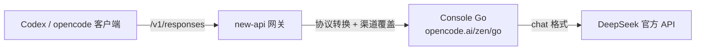
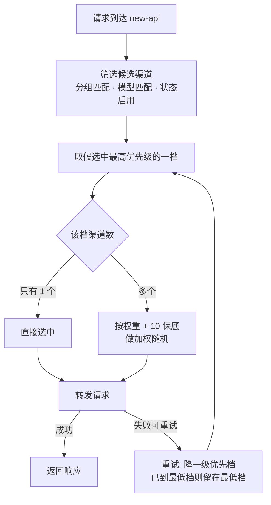

# new-api 协议转换后 Codex 报错两连：会话头缺失与 developer role

new-api 的渠道级协议转换跑通之后，Codex 这类 Responses 格式的客户端终于能直接调用只支持 chat 格式的上游，本以为可以收工，结果连续撞上两个报错：一个是 opencode 托管服务强制的会话请求头，一个是消息 role 不兼容。两个问题最终都在网关渠道配置里解决，这篇文章把报错、根因和修法一次记全。

## 1. 链路与背景

先交代链路。Codex、opencode 这类 AI 编程客户端连到自建的 new-api 网关，网关按渠道配置做协议转换，再转发到上游 Console Go（opencode.ai/zen/go，OpenCode 托管服务），最终落到 DeepSeek 官方 API。



协议转换在渠道编辑里配置（Advanced Custom 渠道的 Converter），方向别配反：客户端用 Responses 入口、上游只支持 Chat，就选「转 OpenAI Chat」，上游路径填 `/v1/chat/completions`。跑通之后，第一波报错来了。

## 2. 报错一：x-opencode-session 缺失

### 2.1 报错现场

```text
Error from provider (Console Go): Request is missing x-opencode-session and cannot be routed efficiently.
```

### 2.2 根因

OpenCode Go 是 opencode 团队的托管服务。2026-09-03 官方公告：从 09-06 起，所有 API 请求必须携带 `x-opencode-session` 请求头，缺失的请求直接报错。

这个头的用途是"每个会话一个稳定 ID"，服务端拿它做 prompt caching 的路由优化。问题在于链路上没人发它：opencode 客户端（尤其旧版本或第三方插件）没有发送逻辑，new-api 作为网关转发时也不会凭空生成。

### 2.3 解决：渠道「请求头覆盖」

new-api 渠道编辑 → 高级设置 → 「请求头覆盖」（`header_override`），填：

```json
{"x-opencode-session": "wsl"}
```

保存后请求头报错立即消失。这是 new-api PR #1447 实现的渠道级能力，转发时自动把头加到上游请求上。

### 2.4 值没有格式要求

官方对值唯一的要求是"每个会话一个稳定 ID"——报错只判断头是否存在，不校验内容，所以固定值随便起，`"wsl"`、`"codex"` 都能用。唯一建议是同一个客户端保持稳定，别每次请求换值。

想做得更精细，官方还支持占位符写法：

```json
{
  "x-opencode-session": "{client_header:x-opencode-session}"
}
```

客户端真实发了头就按真实值透传，缓存优化按真实会话生效；没发则不加头。类似的还有正则透传：key 写 `re:^x-opencode`，把一类请求头全部按原值透传。

## 3. 报错二：developer role 被拒

### 3.1 报错现场

请求头过了，紧接着又来一个：

```text
Failed to deserialize the JSON body into the target type: messages[1].role: unknown variant `developer`, expected one of `system`, `user`, `assistant`, `tool`, `latest_reminder`
```

### 3.2 根因

报错里的 `latest_reminder` 是 DeepSeek V4 编码格式特有的角色，说明这个错其实来自 DeepSeek 官方 API——Console Go 把请求体原样透传了过去。

DeepSeek 官方 API 不接受 `developer` 角色，它只在 DeepSeek 内部 search pipeline 里使用。那 `developer` 从哪来的？opencode 客户端用的 AI SDK 有个默认行为：对 reasoning 模型，自动把 `system` 消息转成 `developer` 消息发送。DeepSeek V4 恰好是 reasoning 模型，正好命中。

### 3.3 解决：渠道「参数覆盖」

同一个渠道编辑弹窗里还有个「参数覆盖」（`param_override`）字段，填：

```json
{
  "operations": [
    {
      "path": "messages.*.role",
      "mode": "replace",
      "from": "developer",
      "to": "system"
    }
  ]
}
```

转发前 new-api 会把请求体里所有 `messages[].role` 的 `developer` 替换成 `system`，上游就合规了。这个写法在 new-api issue #2542 评论区有实测验证。

参数覆盖的能力不止改 role：`operations` 里有十几种操作模式（`set` / `delete` / `append` / `prepend` / `replace` / `regex_replace` 等），还支持按条件判断动态生效。完整语法见官方文档：[渠道管理 · 高级操作模式](https://docs.newapi.pro/zh/docs/guide/feature-guide/admin/channel#%E9%AB%98%E7%BA%A7%E6%93%8D%E4%BD%9C%E6%A8%A1%E5%BC%8F)。

两个坑要注意：

1. 必须用 `messages.*.role` 通配，别用 `messages.0.role`。报错里 `developer` 出现在 `messages[1]`，只改第一条消息根本碰不到它。
2. `replace` 是子串替换模式，这里 `from` 精确等于整个字段值，不会误伤别的文本。

## 4. 两个覆盖是两套格式

这次排查里最容易搞混的就是这两个字段。名字像、位置挨着，但格式完全不同：

| 字段 | 格式 | 用途 |
| --- | --- | --- |
| 请求头覆盖 `header_override` | `{"头名": "值"}` 简单键值对 | 补充或改写转发请求头 |
| 参数覆盖 `param_override` | 简单键值对，或 `{"operations": [...]}` 高级操作模式 | 改写请求体 |

从源码看（`model/channel.go` 的 `GetHeaderOverride`），请求头覆盖就是直接反序列化成一个 map，不支持 operations 写法——那套语法是参数覆盖专属。反过来，参数覆盖改不了请求头。

还有一个共同的坑：渠道开了「透传」，两个覆盖全部失效。透传模式直接转发原始请求，不走网关的任何加工。要么关掉透传，要么依赖客户端自己把头和 role 都发对。

## 5. 渠道的优先级与权重

排障之外，顺手把渠道编辑里另外两个容易含糊的参数讲清楚：优先级（`priority`）和权重（`weight`）。它们决定的是"请求来了，流量给谁"——一个管先后顺序，一个管同层分摊。以下行为以源码 `model/ability.go` 的选择逻辑为准。

### 5.1 优先级：失败降级的顺序

优先级数字越大越优先。new-api 选渠道时，先把该分组、该模型下所有启用渠道按优先级去重、降序排成一列：首次请求只用**最高优先级那一档**的渠道；请求失败重试时，降到下一档；重试次数超过档数时，停在最低档。

使用场景就是主备链：

- 官方、高质量或贵的渠道设高优先级（如 10）；
- 便宜的中转渠道设低优先级（如 0）；
- 平时流量全走官方，官方挂了自动切中转，恢复后自动回切。

### 5.2 权重：同一优先级内的流量分摊

权重只作用于**同一优先级内部**。同级有多个渠道时，按权重做加权随机。注意一个实现细节：每个渠道自带 **+10 的保底权重**，这带来两个结论：

1. `weight=0` 的渠道也会被选中（保底 10），只是概率最小——不存在"配 0 就永不命中"；
2. 流量比例按 `weight + 10` 算，不是按原值。比如 `weight=30` 和 `weight=10` 的两个渠道，实际比例是 40:20 = **2:1**，不是 3:1。

使用场景是同级负载均衡：多个等价渠道（多家供应商、多条线路）按容量或配额分摊流量，某渠道出问题被重试降级或禁用后，流量自然落到同级其他渠道。

### 5.3 选择流程



一句话总结两者的关系：**优先级先分层，权重再在层内分摊**。

| 参数 | 作用范围 | 语义 | 典型场景 |
| --- | --- | --- | --- |
| 优先级 `priority` | 跨档（渠道之间） | 数字越大越先用；失败重试逐级降档 | 主备链：主渠道高、兜底渠道低 |
| 权重 `weight` | 同一优先级档内 | 加权随机，自带 +10 保底 | 同级等价渠道按容量分摊流量 |

顺带区分一个容易混的概念：同一渠道挂多个 Key 是「多 Key 模式」（渠道内部轮询，支持顺序和加权随机），跟渠道之间的 `priority` / `weight` 是两个层面的调度，互不替代。

## 6. 小结

两个报错，两种修法，都收敛在同一个渠道编辑弹窗里：

| 问题 | 归属 | 修法 |
| --- | --- | --- |
| `x-opencode-session` 缺失 | opencode 协议特有 | 请求头覆盖补一个稳定 ID |
| `developer` role 被拒 | 通用兼容问题 | 参数覆盖把 role 改回 system |

在网关统一处理比挨个改客户端划算：一处配置覆盖所有走该渠道的客户端，以后换模型、换上游也不用动客户端。排障顺序也有套路——先看请求头（协议强制的头），再看请求体（字段格式兼容），沿着报错信息里的角色名、字段名往上游协议文档对，基本能快速锁定是哪一层的锅。
