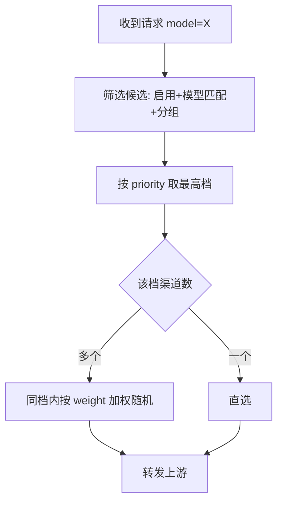
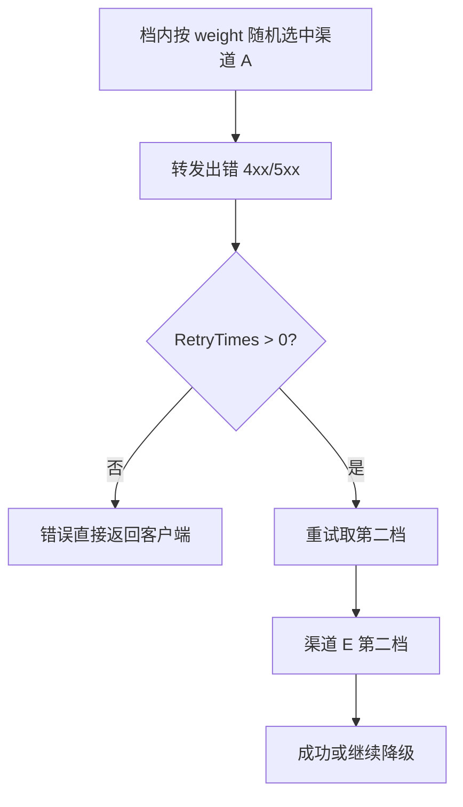
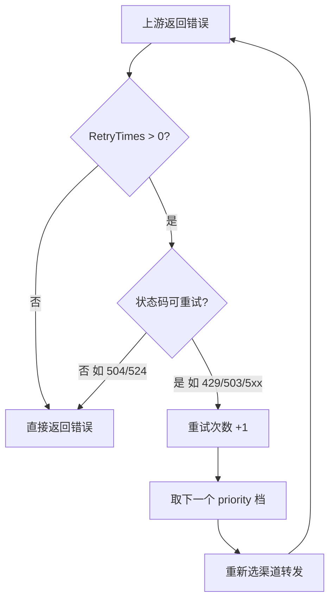
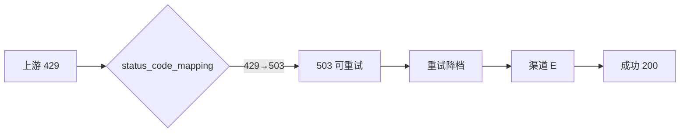
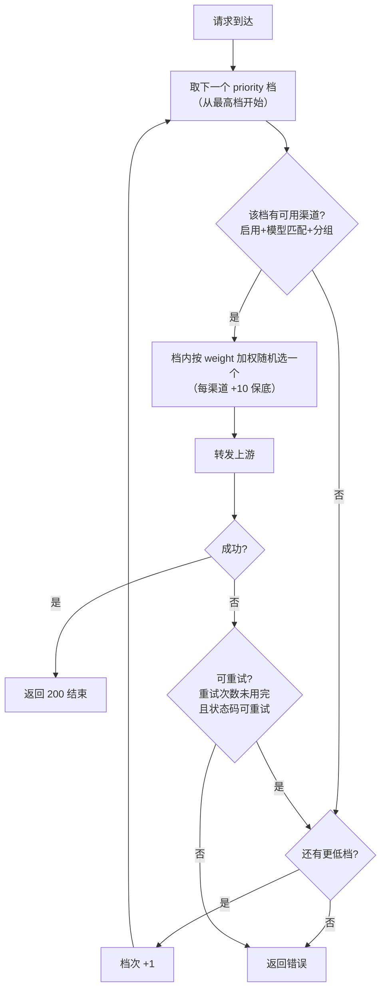

# new-api 分流与重试降级实战：三个免费渠道如何做到逐级兜底

new-api 网关里，「优先级」和「权重」是控制渠道使用顺序的两个参数，但实际跑起来才发现：官方 FAQ 的一句话背后，藏着不少和直觉相反的行为。这篇文章从一个真实的 429 限流事故出发，讲清分流、重试降级的官方规则，以及我们最终用「拆档」解决同档渠道互不兜底问题的全过程。

## 1. 起因：一个限流全员陪跑

内网自建的 new-api（v1.0.0-rc.34）上，同一个模型挂了三个免费渠道（priority 10 同档）、两个中转渠道和一条付费兜底渠道。平时用得挺好，直到每次大请求触发上游 tpm/rpm 限流：

```text
channel error (channel A, status code: 429): inference exceeds tpm/rpm limit
channel error (channel B, status code: 429): inference exceeds tpm/rpm limit
channel error (channel C, status code: 429): inference exceeds tpm/rpm limit
```

诡异的是：三个免费渠道轮流 429，priority 更低的健康渠道（中转、付费兜底渠道）却**一个请求都接不到**。当时的第一反应是路由坏了，翻源码才发现——这是设计行为，不是故障。

## 2. 官方规则：分流与重试降级

### 2.1 分流：priority 决定顺序

官方 FAQ 对这两个参数的解释一共两句话：

- 优先级（Priority）：数字越大优先级越高，优先级高的渠道会优先被使用
- 权重（Weight）：在同优先级的渠道中，按权重比例分配请求

拆开看就是：每个请求**独立选路**，从最高优先级档开始找「启用且模型匹配」的候选，找到就用，**根本不会往下看**；同一档内才轮到权重按比例分摊。不同档之间的权重完全不参与。



源码佐证：`model/ability.go` 里首次选路是 `WHERE priority = MAX(priority)`，只取最高档。

所以「优先被使用」的准确含义是：只要最高档有可用渠道，低优先级渠道的流量就是**恒 0**。

那同档渠道出错会怎么处理？先说结论：**单请求内不换渠道**。

- `RetryTimes=0`（默认）：档内选中的渠道报错，就直接把错误返回给客户端。既不换同档渠道，也不降级——最高档持续报错、低档健康渠道干瞪眼，就是这种配置下的常态（upstream issue `#2367`）。
- `RetryTimes>0`：进入重试循环，但第一次重试取的是**第二档**（源码里 `priorities[retry]` 直接当下标用），不会回到同档再抽一个。同档其他渠道在这一次请求里没机会。
- 所以同档多个渠道的「轮流上岗」是**跨请求维度**的：每一次请求都重新从最高档按 weight 随机，刚才没被抽中的，下次可能被抽中。分摊是它们的本职，兜底不是。
- 429 尤其特别：它默认不触发自动禁用（自动禁用只认 401 和额度/权限类关键词），限流渠道不会被拉黑，下个请求还可能抽到它。



### 2.2 重试：RetryTimes 总开关

官方 FAQ 里还有一句容易被忽略的话：要让失败自动切换渠道，得先开「失败重试」——对应配置是**设置 → 运营设置 → 失败重试次数**（`RetryTimes`）。

源码里它的默认值是 **0**（`common/constants.go`），0 就是完全不重试：渠道报错，直接把这个错误返回给客户端，低优先级渠道再健康也不关它的事。

开启之后，才按状态码判断这次失败值不值得重试，默认可重试范围：

```text
1xx、3xx、401-407、409-499、500-503、505-523、525-599
永远不重试：504、524
```

注意 **429 和 503 都在可重试范围里**。



### 2.3 关键机制：retry 档位索引

这是整个问题的核心。翻 `model/ability.go` 的选渠代码，重试第 N 次的逻辑是：

```go
priorities := SELECT DISTINCT(priority) ... ORDER BY priority DESC
// retry=0 用 priorities[0]，retry=1 用 priorities[1]...
priorityToUse = priorities[retry]
```

**retry 的数字被直接当作「优先级档位列表的下标」用**。也就是说：

- 首轮（retry=0）在最高档内按权重随机选一个渠道
- 它失败后，下一次重试（retry=1）直接取**第二档**，绝不会回最高档再试另一个

同档放多个渠道，只是为了「跨请求分摊流量」；在「单请求失败后互相兜底」这件事上，同档渠道之间形同陌路。这就是文章开头「三个渠道轮流 429、却永不落到低档」的真正原因——同档三个都试过了（每个请求随机命中一个），但单个请求只需要命中一个，失败了就往下走。

## 3. 我们的方案：三步走

### 3.1 开总开关 + 状态码映射

第一步先把重试打开：options 里设 `RetryTimes=5`。

第二步处理 429。429 默认不触发任何自动禁用（自动禁用的状态码默认只有 401），而我们的免费渠道报的就是 429。既然 503 是可重试码，就在渠道高级设置里给三个免费渠道配状态码映射：

```json
{"400": "500", "429": "503"}
```

把上游 429 改写成 503，让重试循环认为「这是值得换渠道的错误」。

效果立刻见效——失败开始降级了，但日志暴露了下一个问题：

```text
channel error (channel A, status code: 503)
use_channel=["A","E"]
```

`渠道 A` 失败后直接落到 **`渠道 E`**（第二档中转渠道），同档的 `渠道 B`、`渠道 C` 还是没机会。



### 3.2 拆档：让同档渠道逐个尝试

既然重试粒度是「档位」而不是「渠道」，那想让哪几个渠道互相兜底，就把它们拆成**相邻的档位**。三个免费渠道从同档 10/10/10，改成顺序档：

| 渠道 | 原 priority | 新 priority |
|---|---|---|
| `渠道 A` | 10 | 10 |
| `渠道 B` | 10 | 9 |
| `渠道 C` | 10 | 8 |
| `渠道 E` | 8 | 7 |
| `渠道 F` 中转渠道 | 8 | 6 |
| `渠道 G` 付费兜底渠道 | 3 | 3 |

重试链变成一条直线：


实测日志（一次请求内，A 失败试 B、B 失败试 C、C 失败落 E）：

```text
channel error (channel A, status code: 503)
channel error (channel B, status code: 503)
channel error (channel C, status code: 503)
use_channel=["A","B","C","E"]
```

这就是「逐级兜底」：免费额度先内耗，内耗完了才轮到付费。

### 3.3 多 Key 模式：为什么没走

遇到「一个渠道几个 Key、失败自动跳过」的需求，第一反应是 new-api 的**多 Key 模式**——官方文档也写了「单个 Key 失败后自动跳过」。但我们追完源码后放弃了：

- 多 Key 的「跳过」发生在**下一个请求**：失败时把坏 Key 标记禁用，后续请求避开它，而不是同一个请求内换 Key 重试。relay 的重试循环每次都重新按档选渠道，失败后直接降档。
- Key 被禁用的触发条件，默认只有 **401** 和额度/权限类关键词，**429/503 不会触发**——对限流场景等于没长眼睛。
- 三个 Key 全部禁用后，整个渠道会被自动禁用；恢复依赖「渠道自动测试」机制，默认关闭，风险比收益大。

结论：多 Key 适合「某个 Key 永久失效」的故障隔离，不适合「限流是临时性的」场景。单请求内的逐级兜底，还是拆档干净。

下面是使用的日志，可以明显看到，当 3 个免费渠道都失败才会走到中转渠道：


## 4. 分场景看效果

配置完的三个典型场景：

### 4.1 场景一：只有一个渠道限流

最常见。请求先打 `渠道 A`，撞上限流后同请求内立即试 `渠道 B` 成功：

```text
channel error (channel A, status code: 503): rpm exhausted
use_channel=["A","B"]
```

### 4.2 场景二：免费渠道部分限流

依次尝试，把免费额度内部消化掉：

```text
use_channel=["A","B","C","E"]
```

### 4.3 场景三：免费渠道全部限流

一路降到 中转渠道、再不行落到 付费兜底渠道 付费兜底——付费只作最后一道防线，平时流量还是优先吃免费。

## 5. 总结：三个教训

- **RetryTimes 是重试总开关，默认关**。不开它，优先级拆得再漂亮、状态码映射再对，失败照样原样报给客户端。
- **new-api 的重试粒度是「档位」不是「渠道」**。想让谁先试谁，就把它们排成相邻档位；同档多渠道只负责分摊流量，不负责互相兜底。
- **429 不触发自动禁用**。限流要兜底，要么用状态码映射把它变成可重试的 5xx，要么接受它只影响单次请求。

最后：配置完一定要看 `use_channel` 日志验证真实降级链路，别相信直觉——这次问题从「以为路由坏了」到「查出是设计行为」，全靠日志说话。

把整套逻辑压缩成一句话：

- **priority** = 档位 → 一档一档往下找（顺序）
- **weight** = 档内抽签 → 同档按比例随机（概率）
- **边界** = 不同档之间 weight 不参与；同档之间 priority 相同不参与

下面是完整的总览流程图，覆盖成功、失败、降级、无渠道所有路径，任意场景都能顺着它走出执行流程：



对照几个典型场景走一遍：

- **正常请求**：`请求 → 最高档有渠道 → 档内随机 → 成功 → 200`
- **场景一（单渠道限流）**：`最高档选中渠道 A → 503 → 可重试 → 取下一档 渠道 B → 成功`
- **场景二（部分限流）**：`渠道 A → 渠道 B → 渠道 C 依次失败 → 落到 中转渠道 档成功`
- **场景三（全部免费限流）**：`一路降到 付费兜底渠道 付费档`
- **极端（全挂/无渠道）**：`所有档都失败或无候选 → 返回错误`

任何一次请求，都能从这个流程图里找到自己走过的路径。