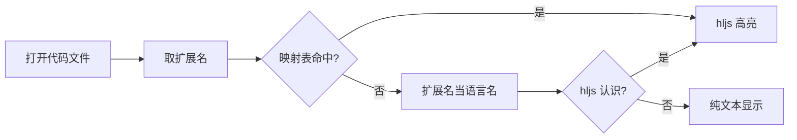

# Obsidian 插件开发实录：代码文件预览

OB Code Preview 是一个 Obsidian 插件，让 .sh、.py、.yaml 这类代码文件在 Obsidian 里像 Markdown 一样打开，内容以代码块形式渲染并高亮。这篇文章记录从需求到发布的全过程，重点讲几个容易踩坑的技术决策，给打算写 Obsidian 插件的朋友做个参考。

## 1. 需求与范围

需求本身很简单：Obsidian 打开 .sh、.py、.yaml 等代码文件时，直接按代码块渲染，而不是弹到系统编辑器。目标用户就是 Obsidian 用户，核心诉求是"看代码文件就像看 md 文件一样"。

动手之前先写了一份 PRD 固定范围，只有一页，但把关键约束都定死了：

- 接管指定扩展名的文件，默认支持 .sh、.py、.yaml、.yml、.ini、.conf
- 扩展名列表可在插件设置里增删，要支持运行中生效
- 只读查看，不支持编辑与运行
- 不做超大文件的性能优化

范围收敛得越小，后面每个技术决策就越清晰。这六个扩展名也决定了高亮引擎的选型。

## 2. 技术选型

三个核心决策：视图基类、高亮引擎、扩展名注册方式。前两个决定渲染效果，第三个决定"扩展名可配置"这个需求能不能优雅落地。

### 2.1 视图基类

Obsidian 自定义视图有三个可继承的基类：ItemView、FileView、TextFileView。最初想用最基础的 ItemView，但这里有坑。

社区论坛有个真实案例：用 ItemView 注册自定义扩展名后，每次点击文件都会新开一个标签页，而不是复用当前标签。原因在于 ItemView 不感知文件生命周期，Obsidian 不知道它是"显示某个文件的视图"。

正确做法是继承 FileView，它额外提供了 `onLoadFile`、`onUnloadFile` 生命周期钩子：

```ts
async onLoadFile(file: TFile) {
    const content = await this.app.vault.read(file);
    this.render(content, file.extension);
}
```

只读视图不需要 TextFileView 的保存机制，FileView 就够。

### 2.2 高亮引擎

三个候选方案：CodeMirror 6、highlight.js、Prism。

CodeMirror 6 最接近 Obsidian 原生编辑体验，自带行号、选择、搜索，但打包体积要几百 KB。一个只读视图，为这点体验付这个体积不太划算。Prism 最轻，但需要自己维护亮暗两套主题 CSS。

最后选了 highlight.js：用 `lib/core` 加按需注册语言，只注册 bash、python、yaml、ini 四个语法，整个高亮器打包后约 20 KB，四个目标扩展名全部开箱支持。

```ts
import hljs from "highlight.js/lib/core";
import bash from "highlight.js/lib/languages/bash";
import ini from "highlight.js/lib/languages/ini";

hljs.registerLanguage("bash", bash);
hljs.registerLanguage("ini", ini);
```

### 2.3 扩展名注册

Obsidian 提供 `registerExtensions` 把扩展名映射到自定义视图类型，但这个 API 有个硬伤：**不能反注册**。而需求要求"运行中增删扩展名"，直接卡在这里。

社区绕法有两种：注册一个固定的超集，让视图自己决定渲染什么；或者要求改设置后重启 Obsidian。前者不彻底，后者体验差。

观察发现运行时的 `viewRegistry` 上其实有 `unregisterExtensions`，只是没进官方 d.ts。做法是绕过类型系统直接操作它，并做运行时能力检测——老版本没有这个方法就提示重启：

```ts
const registry = (app as any).viewRegistry;
if (this.registeredExtensions.length) {
    registry.unregisterExtensions(this.registeredExtensions, VIEW_TYPE);
}
registry.registerExtensions(this.settings.extensions, VIEW_TYPE);
```

扩展名到语言的判断流程如下：



## 3. 踩坑记录

两个坑都是 highlight.js 和 Obsidian API 的细节，各花了一点时间定位。

### 3.1 shell 还是 bash

第一次注册的是 highlight.js 的 `shell` 语言，结果测试时 .sh 文件怎么都不高亮。查了半天才发现：`sh` 是 **bash** 语法模块的别名，`shell` 是"控制台会话"语法，两者不是一回事。

把注册名改成 bash 之后，sh、zsh 通过别名自动可用，一行代码解决：

```ts
hljs.registerLanguage("bash", bash);
```

### 3.2 白捡的别名

用户自定义扩展名时，解析逻辑会先用内置映射表，没命中就用扩展名本身当语言名去问 highlight.js。这带来一个惊喜：用户添加 `.toml` 后，因为 `toml` 恰好是 `ini` 语法的别名，直接免费获得了 INI 风格的高亮。

```ts
const lang = EXT_TO_LANG[normalized] ?? normalized;
return hljs.getLanguage(lang) ? lang : null;
```

查询不到的语言返回 null，视图层回退成纯文本，不会报错。这个兜底逻辑让"用户随意添加类型"变成了安全操作。

## 4. 构建与发布

脚手架直接用官方 sample 插件模板：TypeScript + esbuild。esbuild 的 external 列表要保留 `obsidian` 和 `electron`，让这些模块在运行时由 Obsidian 提供。

### 4.1 自动发布

发布环节用 GitHub Actions 做成了全自动：推送 `v*` 格式的 tag 就触发构建，打包插件 zip，创建 Release。核心是三步：`npm ci` 装依赖、`npm run build` 构建、`zip` 打包。

```yaml
on:
  push:
    tags:
      - 'v*'
```

打包时把 main.js、manifest.json、styles.css 放进以插件 id 命名的文件夹再压缩：

```bash
mkdir -p release/ob-code-preview
cp main.js manifest.json styles.css release/ob-code-preview/
cd release && zip -r ob-code-preview.zip ob-code-preview/
```

首次发布推送 v1.0.0 标签，CI 跑完自动产出了 ob-code-preview.zip，只有 14.6 KB。用户安装时解压放进 vault 的 `.obsidian/plugins/` 目录即可。

## 5. 安装方法

插件通过 GitHub Release 分发，安装只需三步：

1. 打开 [Releases 页面](https://github.com/Hopetree/ob-code-preview/releases)，下载最新的 `ob-code-preview.zip`
2. 解压后，把 `ob-code-preview` 文件夹放进 vault 的 `.obsidian/plugins/` 目录
3. 在 Obsidian「设置 → 第三方插件」中启用 **Code Preview**

之后点击仓库里的 .py、.sh、.yaml 等文件，就会以语法高亮的代码视图打开。扩展名列表可以在插件设置里增删。

如果想手动安装，也可以直接把 `main.js`、`manifest.json`、`styles.css` 三个文件拷贝到插件目录，效果一样。

插件效果：


## 6. 总结

这个插件从需求到发布，最省心的组合是"简单插件 + highlight.js + 自动发布"。

几个值得记住的点：

- 自定义文件视图必须继承 FileView，否则标签页行为不对
- highlight.js 的 sh 是 bash 的别名，不是 shell
- 官方 API 不能反注册扩展名，运行时切换要操作 viewRegistry 并做能力检测
- highlight.js 的语言别名有时会白送额外支持，比如 toml 自动获得 ini 高亮
- 推送 tag 自动发布，让每次发版都是一条命令的事

如果对源码感兴趣，仓库在 github.com/Hopetree/ob-code-preview，文档和代码都在里面。