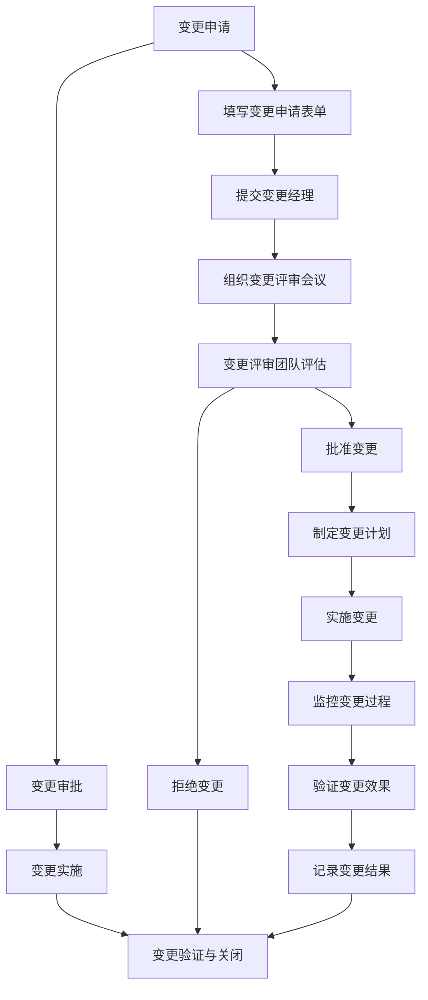

# ITSM变更管理流程规范

## 1. 流程目标

本规范旨在提供一个清晰、标准化的ITSM变更管理流程框架，确保所有变更都经过适当的评估、审批、实施和验证，以降低变更风险，保障IT服务的稳定性。同时，为流程设计者提供明确的指导，便于用户理解和落地执行。

## 2. 适用范围
本流程适用于所有与IT基础架构和业务相关的变更，包括软件升级、硬件更换、配置调整、系统优化等。

## 3. 流程设计原则
+ **简洁性**：流程设计应尽量简洁明了，避免不必要的复杂性。
+ **灵活性**：流程应具备一定的灵活性，以适应不同的变更类型和业务场景。
+ **用户友好性**：流程设计应以用户为中心，确保易于理解和操作。
+ **可扩展性**：流程设计应考虑未来的扩展需求，避免因业务增长或变化而频繁修改。
+ **可度量性**：流程设计应包含关键绩效指标（KPI），以便对流程的执行情况进行量化评估。

## 4. 角色与职责
变更管理流程涉及多个角色，每个角色的职责如下：

### 4.1 变更请求者
+ **职责**：
    - 提出变更请求并填写变更申请表单。
    - 提供变更的详细信息和背景。

### 4.2 变更经理
+ **职责**：
    - 负责变更的审批和协调。
    - 组织变更评审会议。
    - 监督变更的实施过程。
    - 审批变更的关闭。

### 4.3 变更评审团队
+ **职责**：
    - 对变更申请进行评估和审核。
    - 提供技术建议和风险评估。
    - 批准或拒绝变更申请。

### 4.4 变更实施人员
+ **职责**：
    - 根据变更计划实施变更。
    - 确保变更的顺利执行。
    - 提供变更实施的反馈。

### 4.5 变更验证人员
+ **职责**：
    - 验证变更的实施效果。
    - 确保变更达到预期目标。
    - 提供验证报告。

## 5. 流程描述
变更管理流程分为四个主要阶段：变更申请、变更审批、变更实施、变更验证与关闭。

### 5.1 变更申请
+ **申请来源**：用户、服务台、二线/三线支持人员。
+ **记录内容**：变更编号、变更描述、变更类型、影响范围、预计实施时间等。
+ **初步处理**：变更请求者填写变更申请表单，提交给变更经理。

### 5.2 变更审批
+ **评审团队**：变更经理组织变更评审团队对变更申请进行评估。
+ **风险评估**：评审团队对变更的风险、影响范围和必要性进行评估。
+ **审批决策**：评审团队批准或拒绝变更申请。

### 5.3 变更实施
+ **实施计划**：变更经理制定变更实施计划，明确实施步骤和责任人。
+ **实施执行**：变更实施人员按照计划执行变更，记录实施过程。
+ **监控与回退**：变更经理监控变更的实施过程，必要时启动回退计划。

### 5.4 变更验证与关闭
+ **验证效果**：变更验证人员验证变更的实施效果，确保达到预期目标。
+ **记录更新**：变更经理记录变更的实施结果和验证报告。
+ **变更关闭**：变更经理关闭变更记录，确保闭环管理。

## 6. 流程图及角色对应关系
以下是变更管理流程图，并明确标注了每个角色与节点的对应关系：

### 6.1 角色与节点对应关系
| **节点** | **角色** | **职责** |
| --- | --- | --- |
| A（变更申请） | 变更请求者 | 提出变更申请并填写申请表单 |
| E（填写变更申请表单） | 变更请求者 | 提供变更的详细信息 |
| F（提交变更经理） | 变更请求者 | 将变更申请提交给变更经理 |
| G（组织变更评审会议） | 变更经理 | 组织评审团队对变更进行评估 |
| H（变更评审团队评估） | 变更评审团队 | 对变更的风险和影响进行评估 |
| I（批准变更） | 变更评审团队 | 批准变更申请 |
| J（拒绝变更） | 变更评审团队 | 拒绝变更申请 |
| K（制定变更计划） | 变更经理 | 制定变更实施计划 |
| L（实施变更） | 变更实施人员 | 按计划实施变更 |
| M（监控变更过程） | 变更经理 | 监控变更的实施过程 |
| N（验证变更效果） | 变更验证人员 | 验证变更的实施效果 |
| O（记录变更结果） | 变更经理 | 记录变更的实施结果 |

## 7. 节点表单设计
以下是每个关键节点的表单设计，包含字段名称、是否必填、字段类型和描述，确保信息记录的完整性和一致性。

### 7.1 变更申请表单
| **字段名称** | **是否必填** | **字段类型** | **描述** |
| --- | --- | --- | --- |
| 变更编号 | 是 | 字符串（自动生成） | 系统自动生成的唯一编号 |
| 变更描述 | 是 | 富文本 | 变更的详细描述 |
| 变更类型 | 是 | 单选框 | 例如：软件升级、硬件更换、配置调整等 |
| 影响范围 | 是 | 富文本 | 变更可能影响的系统或业务范围 |
| 预计实施时间 | 是 | 日期/时间 | 预计实施变更的时间 |
| 申请理由 | 是 | 富文本 | 提出变更的原因和背景 |
| 申请时间 | 是 | 日期/时间 | 变更申请提交的时间 |
| 申请人 | 是 | 字符串 | 提出变更申请的人员姓名 |

### 7.2 变更审批表单
| **字段名称** | **是否必填** | **字段类型** | **描述** |
| --- | --- | --- | --- |
| 变更编号 | 是 | 字符串 | 关联的变更编号 |
| 审批人 | 是 | 字符串 | 变更评审团队成员姓名 |
| 审批意见 | 是 | 富文本 | 审批人对变更的意见和建议 |
| 风险评估 | 是 | 富文本 | 对变更可能带来的风险评估 |
| 审批结果 | 是 | 单选框 | 批准、拒绝 |
| 审批时间 | 是 | 日期/时间 | 审批完成的时间 |

### 7.3 变更实施计划表单
| **字段名称** | **是否必填** | **字段类型** | **描述** |
| --- | --- | --- | --- |
| 变更编号 | 是 | 字符串 | 关联的变更编号 |
| 实施人员 | 是 | 字符串 | 负责实施变更的人员姓名 |
| 实施步骤 | 是 | 富文本 | 变更的具体实施步骤 |
| 预计开始时间 | 是 | 日期/时间 | 变更实施的预计开始时间 |
| 预计结束时间 | 是 | 日期/时间 | 变更实施的预计结束时间 |
| 回退计划 | 是 | 富文本 | 若变更失败的回退方案 |

### 7.4 变更实施记录表单
| **字段名称** | **是否必填** | **字段类型** | **描述** |
| --- | --- | --- | --- |
| 变更编号 | 是 | 字符串 | 关联的变更编号 |
| 实施人员 | 是 | 字符串 | 实际实施变更的人员姓名 |
| 实施时间 | 是 | 日期/时间 | 变更实际开始的时间 |
| 实施结果 | 是 | 富文本 | 变更实施的具体结果 |
| 遇到问题 | 否 | 富文本 | 实施过程中遇到的问题及解决方案 |
| 实际结束时间 | 是 | 日期/时间 | 变更实际结束的时间 |

### 7.5 变更验证表单
| **字段名称** | **是否必填** | **字段类型** | **描述** |
| --- | --- | --- | --- |
| 变更编号 | 是 | 字符串 | 关联的变更编号 |
| 验证人员 | 是 | 字符串 | 负责验证变更的人员姓名 |
| 验证时间 | 是 | 日期/时间 | 验证变更的时间 |
| 验证结果 | 是 | 单选框 | 成功、失败 |
| 验证描述 | 是 | 富文本 | 验证过程的详细描述 |
| 用户反馈 | 否 | 富文本 | 用户对变更实施的反馈 |

### 7.6 变更关闭表单
| **字段名称** | **是否必填** | **字段类型** | **描述** |
| --- | --- | --- | --- |
| 变更编号 | 是 | 字符串 | 关联的变更编号 |
| 关闭时间 | 是 | 日期/时间 | 变更关闭的时间 |
| 审批人 | 是 | 字符串 | 变更经理姓名 |
| 关闭理由 | 是 | 富文本 | 变更关闭的原因和总结 |
| 知识库链接 | 否 | 字符串 | 变更相关信息在知识库中的链接 |

## 8. 关键绩效指标（KPI）
+ **变更总数与成功率**：衡量变更管理的整体效率。
+ **平均审批时间与实施时间**：衡量变更处理的及时性。
+ **变更失败率**：衡量变更实施的成功率。
+ **用户满意度**：衡量用户对变更实施的满意度。

## 9. 流程文档与培训
+ **详细文档**：提供完整的流程文档，包括流程图、表单设计、角色职责等，确保用户能够快速上手。
+ **培训材料**：设计配套的培训材料和操作手册，帮助用户理解和掌握流程。
+ **在线支持**：提供在线帮助和常见问题解答（FAQ），以便用户在执行流程时能够快速解决问题。

## 10. 流程的验证与测试
+ **模拟运行**：在流程设计完成后，进行模拟运行，以验证流程的可行性和有效性。
+ **用户反馈**：邀请目标用户参与流程测试，收集反馈并优化流程。
+ **持续改进**：根据实际运行情况，定期对流程进行评估和优化，确保其始终符合业务需求。

---

以上是完整的**ITSM变更管理流程规范**，涵盖了流程设计、角色职责、表单设计、关键绩效指标以及流程验证等内容。希望这个规范能够帮助流程设计者和用户更好地理解和落地变更管理流程。