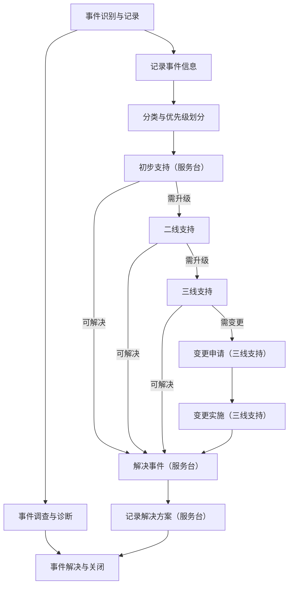

# ITSM事件管理流程规范

## 1. 流程目标

本规范旨在提供一个清晰、标准化的ITSM事件管理流程框架，确保事件能够被快速识别、记录、处理和解决，同时为流程设计者提供明确的指导，便于用户理解和落地执行。

## 2. 适用范围
本流程适用于所有与IT基础架构和业务相关的事件，包括用户报告的故障、咨询、服务请求以及监控系统发现的异常。

## 3. 流程设计原则
+ **简洁性**：流程设计应尽量简洁明了，避免不必要的复杂性。
+ **灵活性**：流程应具备一定的灵活性，以适应不同的业务场景。
+ **用户友好性**：流程设计应以用户为中心，确保易于理解和操作。
+ **可扩展性**：流程设计应考虑未来的扩展需求，避免因业务增长或变化而频繁修改。
+ **可度量性**：流程设计应包含关键绩效指标（KPI），以便对流程的执行情况进行量化评估。

## 4. 角色与职责
事件管理流程涉及多个角色，每个角色的职责如下：

### 4.1 服务台人员
+ **职责**：
    - 接收用户报告的事件和服务请求。
    - 记录事件信息并进行初步分类和优先级划分。
    - 尝试快速解决事件，或升级至二线支持。
    - 跟踪事件处理进度，确保事件闭环。
    - 与用户确认事件解决情况并关闭事件。

### 4.2 一线支持人员
+ **职责**：
    - 处理服务台升级的事件，尝试快速解决。
    - 收集事件相关信息，进行初步诊断。
    - 若无法解决，升级至二线支持。

### 4.3 二线支持人员
+ **职责**：
    - 对事件进行深入调查和诊断。
    - 提出解决方案并实施，必要时升级至三线支持。
    - 负责事件的记录和文档更新。

### 4.4 三线支持人员
+ **职责**：
    - 处理复杂事件，提供技术支持。
    - 协调外部供应商或资源。
    - 提出变更请求以解决事件。

### 4.5 事件经理
+ **职责**：
    - 监督事件管理流程的执行。
    - 处理重大事件和升级事件。
    - 定期审查事件管理报告。

## 5. 流程描述
事件管理流程分为三个主要阶段：事件识别与记录、事件调查与诊断、事件解决与关闭。

### 5.1 事件识别与记录
+ **事件来源**：用户报告、监控系统告警。
+ **记录内容**：事件编号、描述、分类、优先级、发现时间、报告人信息。
+ **初步处理**：服务台对事件进行分类和优先级划分，尝试快速解决。

### 5.2 事件调查与诊断
+ **技术支持**：一线或二线支持人员对事件进行调查和诊断。
+ **升级机制**：若事件无法解决，升级至二线或三线支持。
+ **变更申请**：对于需要系统或配置变更的事件，提交变更请求。

### 5.3 事件解决与关闭
+ **解决方案实施**：二线或三线支持人员实施解决方案。
+ **用户确认**：服务台与用户确认事件是否解决。
+ **记录更新**：事件解决后，记录解决方案、处理过程和用户反馈。
+ **事件关闭**：服务台关闭事件记录，确保闭环。

## 6. 流程图及角色对应关系
以下是事件管理流程图，并明确标注了每个角色与节点的对应关系：

### 6.1 角色与节点对应关系
| **节点** | **角色** | **职责** |
| --- | --- | --- |
| A（事件识别与记录） | 服务台 | 接收事件，记录信息，分类和优先级划分 |
| D（记录事件信息） | 服务台 | 记录事件的详细信息 |
| E（分类与优先级划分） | 服务台 | 对事件进行分类和优先级划分 |
| F（初步支持） | 服务台 | 尝试快速解决事件，或升级至二线支持 |
| G（解决事件） | 服务台 | 解决事件并记录解决方案 |
| H（二线支持） | 二线支持人员 | 进行深入调查和诊断，尝试解决事件，或升级至三线支持 |
| I（三线支持） | 三线支持人员 | 处理复杂事件，提出变更请求 |
| J（变更申请） | 三线支持人员 | 提交变更请求以解决事件 |
| K（变更实施） | 三线支持人员 | 实施变更以解决事件 |
| L（记录解决方案） | 服务台 | 记录解决方案，更新事件状态 |

## 7. 节点表单设计
以下是每个关键节点的表单设计，包含字段名称、是否必填、字段类型和描述，确保信息记录的完整性和一致性。

### 7.1 事件识别与记录表单
| **字段名称** | **是否必填** | **字段类型** | **描述** |
| --- | --- | --- | --- |
| 事件编号 | 是 | 字符串（自动生成） | 系统自动生成的唯一编号 |
| 事件描述 | 是 | 富文本 | 用户或监控系统提供的事件详细信息 |
| 事件分类 | 是 | 单选框 | 故障、告警、咨询、服务请求等 |
| 优先级 | 是 | 单选框 | 紧急、高、中、低 |
| 发现时间 | 是 | 日期/时间 | 事件被发现的时间 |
| 报告人 | 是 | 字符串 | 提交事件的用户或系统名称 |
| 联系方式 | 是 | 字符串 | 报告人的联系方式 |

### 7.2 初步支持表单
| **字段名称** | **是否必填** | **字段类型** | **描述** |
| --- | --- | --- | --- |
| 事件编号 | 是 | 字符串 | 关联的事件编号 |
| 支持人员 | 是 | 字符串 | 服务台人员姓名 |
| 初步诊断 | 是 | 富文本 | 事件的初步诊断结果 |
| 解决措施 | 否 | 富文本 | 尝试的解决措施 |
| 是否解决 | 是 | 单选框 | 是否解决（是/否） |
| 升级原因 | 否 | 富文本 | 若未解决，需说明升级原因 |

### 7.3 二线支持表单
| **字段名称** | **是否必填** | **字段类型** | **描述** |
| --- | --- | --- | --- |
| 事件编号 | 是 | 字符串 | 关联的事件编号 |
| 支持人员 | 是 | 字符串 | 二线支持人员姓名 |
| 详细诊断 | 是 | 富文本 | 事件的详细诊断结果 |
| 解决方案 | 否 | 富文本 | 提出的解决方案 |
| 是否解决 | 是 | 单选框 | 是否解决（是/否） |
| 升级原因 | 否 | 富文本 | 若未解决，需说明升级原因 |

### 7.4 三线支持表单
| **字段名称** | **是否必填** | **字段类型** | **描述** |
| --- | --- | --- | --- |
| 事件编号 | 是 | 字符串 | 关联的事件编号 |
| 支持人员 | 是 | 字符串 | 三线支持人员姓名 |
| 详细诊断 | 是 | 富文本 | 事件的详细诊断结果 |
| 解决方案 | 否 | 富文本 | 提出的解决方案 |
| 是否解决 | 是 | 单选框 | 是否解决（是/否） |
| 变更请求 | 否 | 单选框 | 是否需要变更（是/否） |

### 7.5 变更申请表单
| **字段名称** | **是否必填** | **字段类型** | **描述** |
| --- | --- | --- | --- |
| 变更编号 | 是 | 字符串（自动生成） | 系统自动生成的唯一编号 |
| 事件编号 | 是 | 字符串 | 关联的事件编号 |
| 变更描述 | 是 | 富文本 | 变更的具体内容 |
| 风险评估 | 是 | 富文本 | 变更可能带来的风险 |
| 回退计划 | 是 | 富文本 | 若变更失败的回退方案 |

### 7.6 事件解决与关闭表单
| **字段名称** | **是否必填** | **字段类型** | **描述** |
| --- | --- | --- | --- |
| 事件编号 | 是 | 字符串 | 关联的事件编号 |
| 解决时间 | 是 | 日期/时间 | 事件解决的时间 |
| 解决方案 | 是 | 富文本 | 事件的解决方案 |
| 用户反馈 | 否 | 富文本 | 用户对事件处理的满意度评价 |
| 关闭时间 | 是 | 日期/时间 | 事件关闭的时间 |

## 8. 关键绩效指标（KPI）
+ **事件总数与关闭率**：衡量事件管理的整体效率。
+ **平均响应时间与解决时间**：衡量事件处理的及时性。
+ **用户满意度**：衡量用户对事件处理的满意度。
+ **一线解决率与二线解决率**：衡量不同层级支持团队的解决能力。

## 9. 流程文档与培训
+ **详细文档**：提供完整的流程文档，包括流程图、表单设计、角色职责等，确保用户能够快速上手。
+ **培训材料**：设计配套的培训材料和操作手册，帮助用户理解和掌握流程。
+ **在线支持**：提供在线帮助和常见问题解答（FAQ），以便用户在执行流程时能够快速解决问题。

## 10. 流程的验证与测试
+ **模拟运行**：在流程设计完成后，进行模拟运行，以验证流程的可行性和有效性。
+ **用户反馈**：邀请目标用户参与流程测试，收集反馈并优化流程。
+ **持续改进**：根据实际运行情况，定期对流程进行评估和优化，确保其始终符合业务需求。