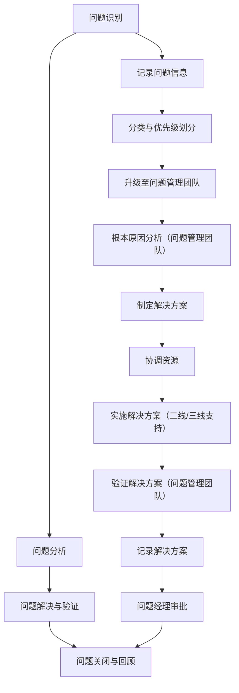

# ITSM问题管理流程规范

## 1. 流程目标

本规范旨在提供一个清晰、标准化的问题管理流程框架，确保问题能够被及时识别、分析、解决，并通过持续改进措施防止问题再次发生。同时，为流程设计者提供明确的指导，便于用户理解和落地执行。

## 2. 适用范围

本流程适用于所有与IT基础架构和业务相关的**问题管理**，包括事件的根本原因分析、问题记录、解决方案制定以及预防措施的实施。

## 3. 流程设计原则
+ **简洁性**：流程设计应尽量简洁明了，避免不必要的复杂性。
+ **灵活性**：流程应具备一定的灵活性，以适应不同的业务场景。
+ **用户友好性**：流程设计应以用户为中心，确保易于理解和操作。
+ **可扩展性**：流程设计应考虑未来的扩展需求，避免因业务增长或变化而频繁修改。
+ **可度量性**：流程设计应包含关键绩效指标（KPI），以便对流程的执行情况进行量化评估。

## 4. 角色与职责
问题管理流程涉及多个角色，每个角色的职责如下：

### 4.1 服务台人员
+ **职责**：
    - 接收用户报告的事件和服务请求。
    - 记录事件信息并识别可能的问题。
    - 将问题升级至问题管理团队。

### 4.2 问题管理团队
+ **职责**：
    - 对事件进行根本原因分析（RCA）。
    - 记录问题的详细信息。
    - 制定解决方案和预防措施。
    - 协调资源以解决问题。

### 4.3 二线/三线支持人员
+ **职责**：
    - 提供技术支持，协助问题管理团队进行分析。
    - 实施解决方案。
    - 提供问题解决后的验证和反馈。

### 4.4 问题经理
+ **职责**：
    - 监督问题管理流程的执行。
    - 审批问题解决方案。
    - 定期审查问题管理报告。
    - 确保问题的闭环管理。

## 5. 流程描述
问题管理流程分为四个主要阶段：问题识别、问题分析、问题解决与验证、问题关闭与回顾。

### 5.1 问题识别
+ **问题来源**：事件管理流程中识别的重复事件、用户报告的问题、监控系统告警。
+ **记录内容**：问题编号、描述、分类、优先级、发现时间、报告人信息。
+ **初步处理**：服务台对问题进行分类和优先级划分，升级至问题管理团队。

### 5.2 问题分析
+ **根本原因分析（RCA）**：问题管理团队对问题进行深入分析，确定根本原因。
+ **解决方案制定**：提出解决方案和预防措施。
+ **资源协调**：协调二线/三线支持人员或外部供应商提供技术支持。

### 5.3 问题解决与验证
+ **解决方案实施**：二线/三线支持人员实施解决方案。
+ **验证与反馈**：问题管理团队验证解决方案的有效性，并收集用户或技术支持团队的反馈。
+ **记录更新**：记录解决方案、实施过程和验证结果。

### 5.4 问题关闭与回顾
+ **问题关闭**：问题经理审批解决方案，关闭问题记录。
+ **经验总结**：定期回顾问题管理流程，总结经验教训，优化流程。
+ **知识共享**：将问题的解决方案和经验教训记录到知识库中，供未来参考。

## 6. 流程图及角色对应关系

以下是问题管理流程图，并明确标注了每个角色与节点的对应关系：

### 6.1 角色与节点对应关系
| **节点** | **角色** | **职责** |
| --- | --- | --- |
| A（问题识别） | 服务台 | 接收问题，记录信息，分类和优先级划分 |
| E（记录问题信息） | 服务台 | 记录问题的详细信息 |
| F（分类与优先级划分） | 服务台 | 对问题进行分类和优先级划分 |
| G（升级至问题管理团队） | 服务台 | 将问题升级至问题管理团队 |
| H（根本原因分析） | 问题管理团队 | 对问题进行根本原因分析 |
| I（制定解决方案） | 问题管理团队 | 提出解决方案和预防措施 |
| J（协调资源） | 问题管理团队 | 协调二线/三线支持人员或外部供应商 |
| K（实施解决方案） | 二线/三线支持人员 | 实施解决方案 |
| L（验证解决方案） | 问题管理团队 | 验证解决方案的有效性 |
| M（记录解决方案） | 问题管理团队 | 记录解决方案和验证结果 |
| N（问题经理审批） | 问题经理 | 审批解决方案，关闭问题记录 |

## 7. 节点表单设计
以下是每个关键节点的表单设计，包含字段名称、是否必填、字段类型和描述，确保信息记录的完整性和一致性。

### 7.1 问题识别表单
| **字段名称** | **是否必填** | **字段类型** | **描述** |
| --- | --- | --- | --- |
| 问题编号 | 是 | 字符串（自动生成） | 系统自动生成的唯一编号 |
| 问题描述 | 是 | 富文本 | 问题的详细描述 |
| 问题分类 | 是 | 单选框 | 例如：硬件故障、软件缺陷、配置错误等 |
| 优先级 | 是 | 单选框 | 紧急、高、中、低 |
| 发现时间 | 是 | 日期/时间 | 问题被发现的时间 |
| 报告人 | 是 | 字符串 | 提交问题的用户或系统名称 |
| 联系方式 | 是 | 字符串 | 报告人的联系方式 |

### 7.2 根本原因分析表单
| **字段名称** | **是否必填** | **字段类型** | **描述** |
| --- | --- | --- | --- |
| 问题编号 | 是 | 字符串 | 关联的问题编号 |
| 分析人员 | 是 | 字符串 | 问题管理团队成员姓名 |
| 分析结果 | 是 | 富文本 | 根本原因分析的结果 |
| 相关事件 | 否 | 多选框 | 与问题相关的事件编号 |
| 解决方案建议 | 是 | 富文本 | 提出的解决方案建议 |

### 7.3 解决方案实施表单
| **字段名称** | **是否必填** | **字段类型** | **描述** |
| --- | --- | --- | --- |
| 问题编号 | 是 | 字符串 | 关联的问题编号 |
| 实施人员 | 是 | 字符串 | 二线/三线支持人员姓名 |
| 实施步骤 | 是 | 富文本 | 解决方案的具体实施步骤 |
| 预计完成时间 | 是 | 日期/时间 | 预计完成解决方案的时间 |
| 实际完成时间 | 否 | 日期/时间 | 实际完成解决方案的时间 |

### 7.4 解决方案验证表单
| **字段名称** | **是否必填** | **字段类型** | **描述** |
| --- | --- | --- | --- |
| 问题编号 | 是 | 字符串 | 关联的问题编号 |
| 验证人员 | 是 | 字符串 | 问题管理团队成员姓名 |
| 验证结果 | 是 | 单选框 | 成功、失败 |
| 验证描述 | 是 | 富文本 | 验证过程的详细描述 |
| 用户反馈 | 否 | 富文本 | 用户对解决方案的反馈 |

### 7.5 问题关闭与回顾表单
| **字段名称** | **是否必填** | **字段类型** | **描述** |
| --- | --- | --- | --- |
| 问题编号 | 是 | 字符串 | 关联的问题编号 |
| 关闭时间 | 是 | 日期/时间 | 问题关闭的时间 |
| 审批人 | 是 | 字符串 | 问题经理姓名 |
| 经验教训 | 是 | 富文本 | 问题管理过程中总结的经验教训 |
| 知识库链接 | 否 | 字符串 | 问题解决方案在知识库中的链接 |

## 8. 关键绩效指标（KPI）
+ **问题总数与关闭率**：衡量问题管理的整体效率。
+ **平均解决时间**：衡量问题处理的及时性。
+ **问题复发率**：衡量问题解决方案的有效性。
+ **用户满意度**：衡量用户对问题处理的满意度。

## 9. 流程文档与培训
+ **详细文档**：提供完整的流程文档，包括流程图、表单设计、角色职责等，确保用户能够快速上手。
+ **培训材料**：设计配套的培训材料和操作手册，帮助用户理解和掌握流程。
+ **在线支持**：提供在线帮助和常见问题解答（FAQ），以便用户在执行流程时能够快速解决问题。

## 10. 流程的验证与测试
+ **模拟运行**：在流程设计完成后，进行模拟运行，以验证流程的可行性和有效性。
+ **用户反馈**：邀请目标用户参与流程测试，收集反馈并优化流程。
+ **持续改进**：根据实际运行情况，定期对流程进行评估和优化，确保其始终符合业务需求。

---

以上是**问题管理流程规范**的完整内容，结合了流程设计的指导性、可操作性和落地性。希望这个规范能够帮助流程设计者和用户更好地理解和执行问题管理流程。