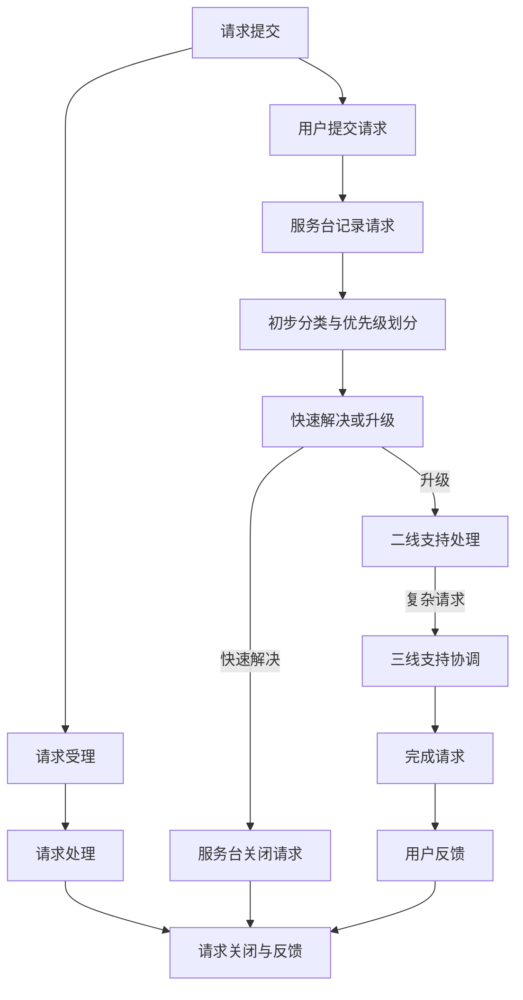

# ITSM服务请求流程规范

## 1. 流程目标

本规范旨在提供一个清晰、标准化的服务请求管理流程框架，确保所有用户的服务请求能够被及时受理、高效处理，并以符合用户期望的方式完成，同时为流程设计者和用户提供明确的指导，便于理解和落地执行。

## 2. 适用范围

本流程适用于所有与IT服务相关的用户请求，包括但不限于软件安装、授权访问、设备升级、技术支持等。

## 3. 流程设计原则
+ **简洁性**：流程设计应尽量简洁明了，避免不必要的复杂性。
+ **灵活性**：流程应具备一定的灵活性，以适应不同的服务请求类型和业务场景。
+ **用户友好性**：流程设计应以用户为中心，确保易于理解和操作。
+ **可扩展性**：流程设计应考虑未来的扩展需求，避免因业务增长或变化而频繁修改。
+ **可度量性**：流程设计应包含关键绩效指标（KPI），以便对流程的执行情况进行量化评估。

## 4. 角色与职责
服务请求管理流程涉及多个角色，每个角色的职责如下：

### 4.1 服务请求提交者
+ **职责**：
    - 提交服务请求并填写相关信息。
    - 提供必要的背景信息以帮助处理请求。

### 4.2 服务台人员
+ **职责**：
    - 接收并记录服务请求。
    - 对请求进行初步分类和优先级划分。
    - 尝试快速解决请求，或将其升级至二线支持。

### 4.3 二线支持人员
+ **职责**：
    - 处理服务台升级的服务请求。
    - 提供技术支持以满足用户请求。
    - 若无法解决，升级至三线支持。

### 4.4 三线支持人员
+ **职责**：
    - 处理复杂的服务请求。
    - 协调外部资源或供应商以完成请求。

### 4.5 服务请求经理
+ **职责**：
    - 监督服务请求管理流程的执行。
    - 审批关键服务请求。
    - 定期审查服务请求管理报告。

## 5. 流程描述
服务请求管理流程分为四个主要阶段：请求提交、请求受理、请求处理、请求关闭与反馈。

### 5.1 请求提交
+ **提交方式**：用户通过服务台系统、邮件或电话提交服务请求。
+ **记录内容**：请求编号、描述、请求类型、优先级、提交时间、提交人信息。

### 5.2 请求受理
+ **受理人员**：服务台人员对请求进行分类和优先级划分。
+ **初步处理**：服务台人员尝试快速解决请求，或将其升级至二线支持。

### 5.3 请求处理
+ **技术支持**：二线或三线支持人员根据请求内容提供技术支持。
+ **资源协调**：必要时，协调外部资源或供应商。

### 5.4 请求关闭与反馈
+ **关闭条件**：请求完成且用户满意。
+ **反馈收集**：收集用户对服务的满意度反馈。

## 6. 流程图及角色对应关系

以下是服务请求管理流程图，并明确标注了每个角色与节点的对应关系：

### 6.1 角色与节点对应关系

| **节点** | **角色** | **职责** |
| --- | --- | --- |
| A（请求提交） | 服务请求提交者 | 提交服务请求并填写相关信息 |
| E（用户提交请求） | 服务请求提交者 | 提交请求并提供背景信息 |
| F（服务台记录请求） | 服务台人员 | 接收并记录请求 |
| G（初步分类与优先级划分） | 服务台人员 | 对请求进行分类和优先级划分 |
| H（快速解决或升级） | 服务台人员 | 尝试快速解决请求或升级 |
| I（服务台关闭请求） | 服务台人员 | 关闭已解决的请求 |
| J（二线支持处理） | 二线支持人员 | 处理升级的服务请求 |
| K（三线支持协调） | 三线支持人员 | 处理复杂请求并协调资源 |
| L（完成请求） | 二线/三线支持人员 | 完成服务请求 |
| M（用户反馈） | 服务请求提交者 | 提供对服务的满意度反馈 |

## 7. 节点表单设计
以下是每个关键节点的表单设计，包含字段名称、是否必填、字段类型和描述，确保信息记录的完整性和一致性。

### 7.1 请求提交表单
| **字段名称** | **是否必填** | **字段类型** | **描述** |
| --- | --- | --- | --- |
| 请求编号 | 是 | 字符串（自动生成） | 系统自动生成的唯一编号 |
| 请求描述 | 是 | 富文本 | 用户对服务请求的详细描述 |
| 请求类型 | 是 | 单选框 | 例如：软件安装、授权访问、设备升级等 |
| 优先级 | 是 | 单选框 | 紧急、高、中、低 |
| 提交时间 | 是 | 日期/时间 | 请求提交的时间 |
| 提交人 | 是 | 字符串 | 提交请求的用户姓名 |
| 联系方式 | 是 | 字符串 | 提交人的联系方式 |

### 7.2 请求受理表单
| **字段名称** | **是否必填** | **字段类型** | **描述** |
| --- | --- | --- | --- |
| 请求编号 | 是 | 字符串 | 关联的请求编号 |
| 受理人 | 是 | 字符串 | 服务台人员姓名 |
| 受理时间 | 是 | 日期/时间 | 请求受理的时间 |
| 初步诊断 | 是 | 富文本 | 对请求的初步诊断结果 |
| 处理建议 | 是 | 富文本 | 建议的处理方式 |
| 是否升级 | 是 | 单选框 | 是否需要升级至二线支持 |

### 7.3 请求处理表单
| **字段名称** | **是否必填** | **字段类型** | **描述** |
| --- | --- | --- | --- |
| 请求编号 | 是 | 字符串 | 关联的请求编号 |
| 处理人员 | 是 | 字符串 | 二线或三线支持人员姓名 |
| 处理步骤 | 是 | 富文本 | 请求的具体处理步骤 |
| 预计完成时间 | 是 | 日期/时间 | 预计完成请求的时间 |
| 实际完成时间 | 否 | 日期/时间 | 实际完成请求的时间 |

### 7.4 请求关闭与反馈表单
| **字段名称** | **是否必填** | **字段类型** | **描述** |
| --- | --- | --- | --- |
| 请求编号 | 是 | 字符串 | 关联的请求编号 |
| 关闭时间 | 是 | 日期/时间 | 请求关闭的时间 |
| 用户反馈 | 是 | 富文本 | 用户对服务的满意度评价 |
| 关闭人 | 是 | 字符串 | 关闭请求的人员姓名 |

## 8. 关键绩效指标（KPI）
+ **请求总数与关闭率**：衡量服务请求管理的整体效率。
+ **平均处理时间**：衡量服务请求处理的及时性。
+ **用户满意度**：衡量用户对服务请求处理的满意度。

## 9. 流程文档与培训
+ **详细文档**：提供完整的流程文档，包括流程图、表单设计、角色职责等，确保用户能够快速上手。
+ **培训材料**：设计配套的培训材料和操作手册，帮助用户理解和掌握流程。
+ **在线支持**：提供在线帮助和常见问题解答（FAQ），以便用户在执行流程时能够快速解决问题。

## 10. 流程的验证与测试
+ **模拟运行**：在流程设计完成后，进行模拟运行，以验证流程的可行性和有效性。
+ **用户反馈**：邀请目标用户参与流程测试，收集反馈并优化流程。
+ **持续改进**：根据实际运行情况，定期对流程进行评估和优化，确保其始终符合业务需求。

---

以上是完整的**ITSM服务请求管理流程规范**，涵盖了流程设计、角色职责、表单设计、关键绩效指标以及流程验证等内容。希望这个规范能够帮助流程设计者和用户更好地理解和落地服务请求管理流程。