# iptables 规则导致的容器监听端口无法被外部访问问题记录

今天遇到了一个关于 iptables 防火墙规则设置的问题：同样的进出规则，导致外部服务器请求目标服务器上面的本地监听端口正常，但是访问 docker 服务监听的端口不通。由于这个问题的排查和处理方式比较有参考意义，所以决定记录下来。


## 问题背景

下面是一些背景信息：

1. 现在有两个服务器：请求者01，目标03
2. 03是一个运行容器的宿主机，有个服务监听的8080端口，还有个容器监听了8088端口，都是监听到宿主机的 0.0.0.0
3. 问题现象：01可以正常请求到 8080端口，无法请求通8088端口，而03自己可以完全请求两个端口，无论使用 127的IP还是内网静态IP都可以
4. 重启服务器03问题就不存在了，一旦设置 iptables 规则就复现问题，所以基本断定问题出在 iptables 规则上


## iptables 规则

直接看我设置的规则，这里的规则是使用一个脚本设置的，大概意思就是可以对指定的IP或者网段开放所有端口，然后对其他IP只开发指定的端口，这种设置方式也是我们公司经常使用的一套规则。

大概脚本：

```bash
#!/bin/bash

# *********************** Script Config *************************
#action="set"
#white_list_ips="192.168.31.80 192.168.31.108"
#open_ports="22 80 443"
# ************************ Script Body **************************
# 清除已有iptables规则
function clear() {
    iptables -F  # 清空所有的防火墙规则
    iptables -X  # 删除用户自定义的空链
    iptables -Z  # 清空计数
}
# 开放指定的端口
function set_rules() {
    iptables -A INPUT -p icmp --icmp-type 8 -j ACCEPT                   # 允许被ping
    iptables -A INPUT -m state --state ESTABLISHED,RELATED -j ACCEPT    # 允许已建立的或相关连的通行
    # 设置本机规则
    iptables -A INPUT -i lo -j ACCEPT                                   # 本地127.0.0.1可以进
    iptables -A OUTPUT -o lo -j ACCEPT                                  # 本地127.0.0.1可以出
    # 设置默认规则
    iptables -P INPUT DROP                                              # 配置默认的不让进
    iptables -P FORWARD DROP                                            # 默认的不允许转发
    iptables -P OUTPUT ACCEPT                                           # 默认的可以出去
    # 设置白名单，根据工具传入的多行IP进行循环设置
    for white_ip in ${white_list_ips[@]};do
        iptables -A INPUT -p all -s ${white_ip} -j ACCEPT               # 对指定ip开放所有端口
    done
    # 设置对外规则开放指定端口,22 80 443 5511 8820默认应该放开，其他端口看情况加
    for open_port in ${open_ports[@]};do
        iptables -A INPUT -p tcp --dport ${open_port} -j ACCEPT
    done
    # 自定义命令，通过工具参数传入
    if [ -n "${more_rules}" ]; then
        echo "执行更多命令：${more_rules}"
        ${more_rules}
    else
        echo "no more rules."
    fi

}
# 屏蔽IP，按需修改，默认不运行，有需要在这里添加更多规则运行即可
function set_ip_rules() {
    iptables -I INPUT -s 123.45.6.7 -j DROP                             # 屏蔽单个IP的命令
    iptables -I INPUT -s 123.0.0.0/8 -j DROP                            # 封整个段即从123.0.0.1到123.255.255.254的命令
    iptables -I INPUT -s 124.45.0.0/16 -j DROP                          # 封IP段即从123.45.0.1到123.45.255.254的命令
    iptables -I INPUT -s 123.45.6.0/24 -j DROP                          # 封IP段即从123.45.6.1到123.45.6.254的命令是
}
# 保存规则到文件
function save_rules() {
    if [ -f /etc/sysconfig/iptables ];then
        backup_filename=/etc/sysconfig/iptables.bak.$(date +'%Y%m%d.%H%M%S')
        cp /etc/sysconfig/iptables ${backup_filename}                   # 备份配置文件
        echo "原规则文件备份为：${backup_filename}"
    fi
    iptables-save > /etc/sysconfig/iptables                             # 把配置文件导入到文件
    iptables-restore < /etc/sysconfig/iptables                          # 让配置文件生效
    iptables -L -n -v                                                   # 查看配置是否生效
}

# 根据工具传入的参数执行对应操作
case ${action} in
read)
	echo "读取现有iptables规则"
	iptables -L -n -v
    ;;
set)
	echo "设置平台iptables规则"
	clear
	set_rules
	save_rules
	;;
*)
	echo "action need (read|set)"
	;;
esac

```

可以看到正如脚本本身想要做到的效果，这里的规则主要涉及到先清理规则，然后重新设置规则，保证对指定IP或网段开放所有，然后其他IP只开放固定端口。

## 排查问题

经过跟 ChatGPT 多次拉扯，终于定位到了问题所在，就是这个脚本里面的两个地方，第一个地方是清空了所有规则 `iptables -F`，然后初始化了 `iptables -P FORWARD DROP`，这两句相当于初始化了 FORWARD 规则为禁用。也就是只要是走 FORWARD 的都被挡住。

而恰巧，docker 运行的服务，监听的端口从外部访问就是走 FORWARD，就被挡住了。经过一番查验，大概可以理解为，外服服务要访问容器的服务，是会由宿主机进行一个转发操作的，这个转发就是 FORWARD 的行为。

## 处理方式

首先是手动添加规则，解决问题，执行的命令是：

```bash
iptables -P FORWARD ACCEPT
```

很显然，这个命令就是跟脚本里面 `iptables -P FORWARD DROP` 相反的，也就是接受转发。

当然，我优化了脚本，去掉了关于 FORWARD 规则的操作，只清理和设置 INPUT 和 OUTPUT 规则，具体不表。

## 总结

这里我让 ChatGPT 给我生成了一个图来解释这三个场景：

```mermaid
flowchart TD
    %% 场景 3: 宿主机内部访问容器端口（修正）
    subgraph LOCAL_DOCKER["场景3: 宿主机内部访问容器映射端口"]
        A3[宿主机本机请求:127.0.0.1:8088] --> B3[INPUT 链]
        B3 --> C3{DOCKER 链 / DNAT}
        C3 --> E3[容器网卡 eth0]
        E3 --> F3[容器服务:80端口]
        F3 --> G3[响应返回宿主机] --> H3[宿主机进程收到响应]

        style B3 fill:#ff9999,stroke:#333,stroke-width:2px
        style C3 fill:#ff9999,stroke:#333,stroke-width:2px
        style E3 fill:#ffff99,stroke:#333,stroke-width:2px
        style F3 fill:#ffffcc,stroke:#333,stroke-width:2px
    end

    %% 场景 2: 外部访问宿主机映射到容器端口
    subgraph EXT_DOCKER["场景2: 外部访问宿主机映射到容器端口"]
        A2[外部请求:宿主机IP:8088] --> B2[NAT PREROUTING 链]
        B2 --> C2{DOCKER 链}
        C2 -->|匹配端口映射规则| D2[FORWARD 链]
        D2 --> E2[容器网卡 eth0]
        E2 --> F2[容器服务:80端口]
        F2 --> G2[容器出口流量] --> H2[FORWARD 返回] --> I2[外部响应]

        style B2 fill:#ffcc99,stroke:#333,stroke-width:2px 
        style C2 fill:#ff9999,stroke:#333,stroke-width:2px 
        style D2 fill:#99ccff,stroke:#333,stroke-width:2px 
        style E2 fill:#ffff99,stroke:#333,stroke-width:2px 
        style F2 fill:#ffffcc,stroke:#333,stroke-width:2px 
		style H2 fill:#99ccff,stroke:#333,stroke-width:2px
    end
	
    %% 场景 1: 外部访问宿主机本地端口
    subgraph EXT_LOCAL["场景1: 外部访问宿主机本地端口"]
        A1[外部请求:宿主机IP:8080] --> B1[INPUT 链]
        B1 --> C1[宿主机本地服务:8080]
        C1 --> D1[OUTPUT 链] --> E1[响应返回外部]

        style B1 fill:#ff9999,stroke:#333,stroke-width:2px 
        style D1 fill:#99ff99,stroke:#333,stroke-width:2px 
        style C1 fill:#ffff99,stroke:#333,stroke-width:2px 
    end
```



::: tip

顺便说一下，iptables 清空所有规则这种操作其实还挺危险的，特别是当你不清楚这个服务器上面本身是否由于需要而设置了一些规则的时候，千万不要随意执行清空规则这种操作，就算要执行，也应该是去清理后续会初始化的规则。

据我所见，docker 启动的时候会初始化一些基本的规则，还有组网工具 TailScale 和 Zerotier 之类的都会设置一些基本规则。
:::